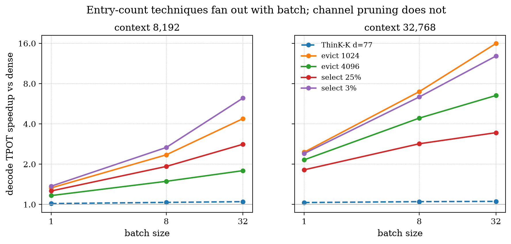
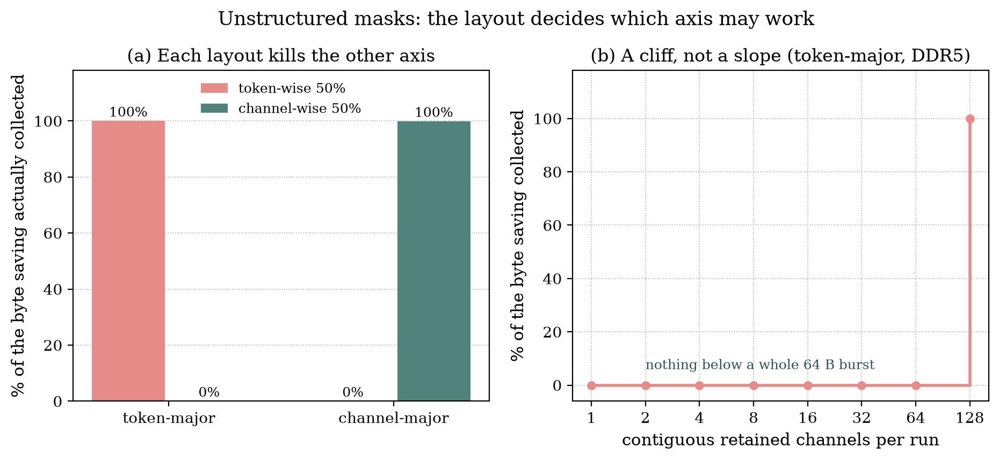
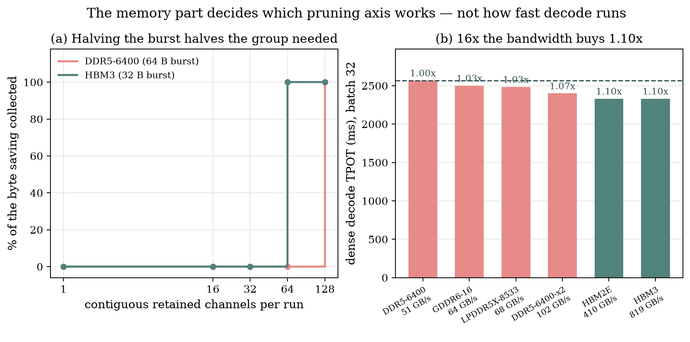
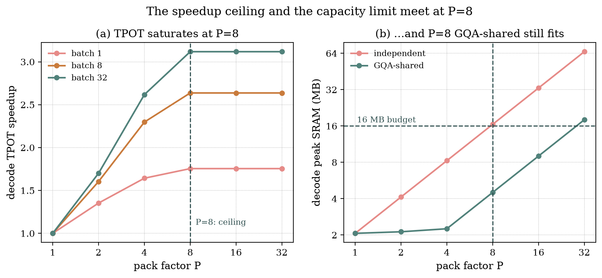
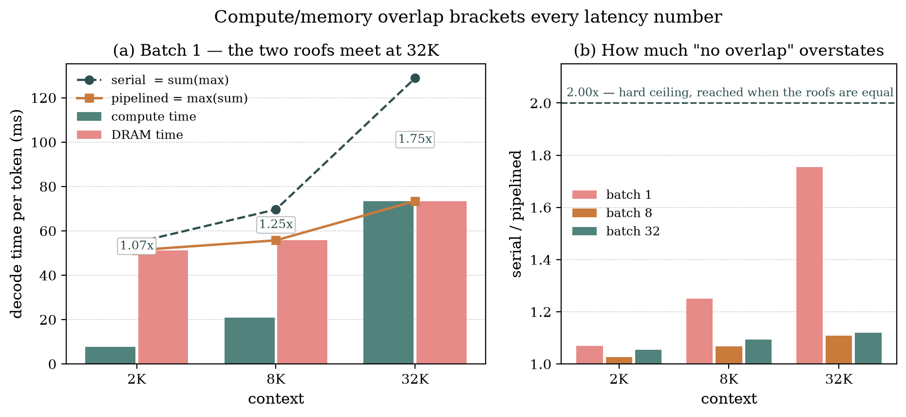

# Omni-LUT — The Argument, In Detail

## 1. Is decode compute-bound or memory-bound?

Every KV-reduction paper rests on one premise: decode is memory-bound, so
removing bytes buys time. This section tests that premise. The short version:

> **It is true only in a corner of the operating space — and inside that corner
> the binding resource is weights, not KV.**

Three findings, in order.

### 1.1 Memory-bound is a triangle, not a property

Decode compute ÷ DRAM per token. **Below 1.00 the array waits on memory:**

| batch | 2K | 4K | 8K | 16K | 32K |
|---:|---:|---:|---:|---:|---:|
| 1 | 0.15 | 0.23 | 0.38 | 0.62 | 1.00 |
| 2 | 0.28 | 0.43 | 0.67 | **1.04** | 1.51 |
| 4 | 0.52 | 0.76 | **1.12** | 1.56 | 2.02 |
| 8 | 0.93 | **1.28** | 1.69 | 2.10 | 2.44 |
| 16 | **1.57** | 1.93 | 2.27 | 2.54 | 2.73 |
| 32 | 2.37 | 2.60 | 2.74 | 2.84 | 2.90 |

The memory-bound cells form a triangle in the low-batch, short-context corner.
Everywhere else the array is the constraint.

First compute-bound batch, by context:

| context | 2K | 4K | 8K | 16K | 32K |
|---|---:|---:|---:|---:|---:|
| **batch** | 16 | 8 | 4 | 2 | 2 |

**So "decode is DRAM-bound" is the batch-1 row, and only that row.**

### 1.2 The boundary is diagonal because weight traffic is constant

The triangle's shape is not arbitrary. It follows from one measured fact:

> **Weight DRAM costs 49.81 ms per token at every cell of the grid** — every
> batch, every context, without exception.

Weights are read once per token no matter how many sequences are in flight or
how long they are. DRAM therefore has a large fixed floor. Compute has no such
floor: it grows with batch *and* with context.

At batch 1, watch the two columns close:

| ctx | compute | DRAM | weights' share of DRAM | C/D |
|---:|---:|---:|---:|---:|
| 2K | 7.67 ms | 51.28 ms | 97.1% | 0.15 |
| 8K | 20.94 ms | 55.71 ms | 89.4% | 0.38 |
| 32K | 73.33 ms | 73.40 ms | 67.9% | **1.00** |

DRAM barely moves — 51 ms to 73 ms — while compute grows tenfold. The crossover
is simply *"when does compute exceed the constant 50 ms of weight traffic?"*
Both batch and context push it the same way, so the boundary cuts diagonally
across the grid instead of sitting at a fixed batch or a fixed context.

At 32K / batch 1 the two roofs land at **73.33 against 73.40 ms** — the most
evenly balanced point in the grid. That near-coincidence matters again in §5.

### 1.3 Inside the triangle, the bottleneck is weights — not KV

This is the finding that reframes the KV literature. Take the most
memory-bound cell in the whole grid, 2K / batch 1:

| | time | share |
|---|---:|---:|
| weight DRAM | 49.81 ms | **97.1%** |
| KV DRAM | ~1.5 ms | **2.9%** |
| compute | 7.67 ms | array idle **86%** |

That is roughly 2.6 GB of weights per token against 80 MB of KV.

**At batch 1 you can attack the KV cache as hard as you like and still be
optimising 2.9% of the bottleneck.**

### 1.4 What any lever could possibly buy

The bound that makes this quantitative. Each column is the speedup if that
resource became **entirely free** — a ceiling no algorithm can beat:

| batch | ctx | packing | overlap | KV bytes | weight bytes |
|---:|---:|---:|---:|---:|---:|
| 1 | 2K | 1.07× | 1.07× | **1.01×** | **6.80×** |
| 1 | 32K | 1.75× | 1.75× | **1.07×** | 1.57× |
| 32 | 2K | 1.88× | 1.05× | 1.05× | 1.00× |
| 32 | 32K | **3.12×** | 1.12× | 1.12× | 1.00× |

**Deleting the entire KV cache at batch 1 buys 1.01× at 2K and 1.07× at 32K.**
Not "eviction buys little" — removing all of it buys 7%. That is an
algorithm-independent ceiling on the whole KV literature at batch 1, and it is
the one-line explanation for every negative result in §2.

The levers that are *not* bounded that way split by regime:

| regime | lever | worth |
|---|---|---:|
| inside the triangle (low batch, short ctx) | weight bytes | **6.80×** |
| outside it (high batch, long ctx) | array occupancy | **3.12×** |

Neither is a KV technique. And the two regimes want different machines — one
tuned for weight bandwidth, one for array occupancy. **Two accelerators, not
one.**

### 1.5 How this was measured

Per operation the roofline charges:

```
time = max( cycles / freq ,  dram_bytes / bandwidth )
```

Sum over every GEMM in a decode step, accumulating compute into `C` and DRAM
into `D`. The regime is the ratio `C/D`.

For reference, the machine's own crossover — computed in code rather than
quoted, so it cannot drift:

```
2 × LANES_EQUIV × freq / bandwidth = 2 × 4096 × 500e6 / 51.2e9 = 80 FLOP/byte
```

Decode attention sits far below 80 FLOP/byte, which is exactly why
"memory-bound" sounds obviously true, and why measuring it anyway was worth the
trouble.

**Two things nearly went wrong, both worth recording:**

- **The obvious split is wrong.** Grouping AW ops as "weights" and AA ops as
  "KV" fails, because `k_proj` and `v_proj` are AW operations that *write the KV
  cache*. It made weight DRAM drift 0.04% between batch 1 and batch 32 — a
  quantity that must be exactly constant. The split has to be **by read/write,
  not by operation**, and the pre-flight comparing batch 1 to batch 32 is what
  caught it.
- **The first version of this grid was wrong.** Every row but batch 1 sat in the
  wrong regime, because of a cycle defect that dropped the batch term entirely.
  That is §6 — reported rather than quietly corrected, because the grid above is
  only as trustworthy as the audit behind it.

---

## 2. The recurring pattern — one formula behind every result

### 2.1 The claim

> Channel pruning, select-without-evict and KV residency each removed real DRAM
> traffic and each produced little or no speedup. Eviction removed the same kind
> of traffic and **did** produce speedup. A single line of arithmetic predicts
> both, in advance.

The three failures have nothing in common algorithmically. ThinK drops feature
channels; Quest skips reading blocks it still stores; residency moves bytes
on-chip. Different papers, different mechanisms, different motivations. The only
thing they share is **which resource they attack** — KV DRAM bytes.

When three unrelated methods fail identically, the failure is a property of the
resource, not of any method. That inference is what makes this a *pattern* and
not three unlucky measurements.

### 2.2 The formula, in full

Everything follows from the OS-V cycle count:

```
cycles   = batch_size × per_round × rounds × qbit

per_round = LUT_GEN(3) + ceil(K / MU) + 1 + array_n + OUTPUT(2)
rounds    = ceil(n_tiles / array_m)
n_tiles   = ceil(N / (array_n × NUM_RAC))
```

With this machine's constants — `MU = 4`, `array_m = 32`, `array_n = 4`,
`NUM_RAC = 32` — and decode `attn_v`'s shape `(M=1, K=kv_len, N=head_dim=128)`:

```
per_round = ceil(kv_len/4) + 10          ← `presentation.md` §3's knee
n_tiles   = ceil(128 / 128) = 1
rounds    = ceil(1 / 32)   = 1
```

Now ask, for each dimension of the KV cache, **where it appears in that
expression**. This is the whole analysis:

| axis | technique | where it enters | cycles | DRAM | measured |
|---|---|---|---|---|---:|
| channel (`head_dim` = N) | ThinK | only `ceil(N/128)` | **null** | linear | **1.000×** |
| token (`kv_len` = K) | **eviction** (H2O, SnapKV) | `k_eff = ceil(K/4)` | **linear** | linear | **1.45× b1 · 15.96× b32** |
| token, read-only | Quest, TidalDecode | `k_eff`, storage unchanged | linear | linear | 12.85× b32 |
| **bit-width** (`qbit`) | KV3 / KV2 | outer multiplier | **linear** | **linear** | **unmeasured** |

### 2.3 Reading the table one row at a time

**Channel — the null.** `head_dim` is `attn_v`'s **output** dimension `N`, and
`N` reaches the cycle count through exactly one term: `ceil(N/128)`. For every
`N ≤ 128` that term is `1`. Pruning 128 channels to 64, or to 8, does not change
it. **`N` is not merely weakly present — it is absent.**

This is why `presentation.md` §4's result is *exactly* 1.000× rather than "small". A weak effect
would be 1.03×; an absent term is 1.000×. The measurement distinguishes them,
and it came out on the "absent" side.

The corollary is the sentence worth remembering: *the axis that saves cycles is
the stage that costs nothing.* Channel pruning does shrink `qk` — but `qk` is
**4.1% of decode**, because in `LUT_OS_V` qk's `N` is `kv_len` (parallelised)
while attn_v's is `head_dim` (serialised over the cache).

**Token — the survivor, and the proof the table is honest.** `kv_len` is
`attn_v`'s reduction dimension `K`, and it enters through `k_eff = ceil(K/MU)`
inside `per_round`. That term is linear and unbounded. So eviction **must**
remove cycles — not "might", must — and therefore **must** work.

This row is the reason this section is a model rather than an excuse. A framework that
only ever explains failures is unfalsifiable. This one commits in both
directions from the same arithmetic, and the commitment holds: eviction to 1024
entries is **15.96× at batch 32**.

**Same bytes. Same hardware. Opposite outcome. One line of arithmetic apart.**

**Token, read-only — the intermediate case.** Quest reads fewer blocks but
stores the full cache. It is **byte-identical to eviction** on the read path and
differs only in storage. If bytes were what mattered, the two would be
indistinguishable. If `k_eff` is what matters, they should nearly coincide —
and they do: **12.85× against eviction's 15.96×** at batch 32. The residual gap
is storage, not compute.

**Bit-width — the axis with no null anywhere.** `qbit` multiplies the *entire*
expression. There is no `ceil` outside it, so nothing can absorb it. KV4 → KV3
is 0.75× cycles **and** 0.75× bytes, unconditionally, at every context and every
batch.

Contrast that with channel pruning, which dies on a rounding boundary. **Channel
pruning has a boundary to die on; bit-width does not.**

### 2.4 The discriminator, stated plainly

> The question is never *"how many bytes does this remove?"*
> It is *"does it reach `k_eff` or `qbit`?"*

Every technique that touches only DRAM lands inside §1.4's batch-1 ceiling
of **1.01–1.07×**. Every technique that lowers the compute roof
survives. That is the entire selection rule, and it is checkable on paper before
a single simulation runs.

### 2.5 Why bit-width is the experiment to run

Two properties, and the second is the one usually missed:

**No null.** Established above — an outer multiplier cannot be rounded away.

**It composes with eviction rather than competing.** Since
`cycles ∝ k_eff × qbit`, the two axes are **orthogonal and multiply**.
`evict-1024` at KV3 is approximately the *product* of the two speedups, not the
larger of them.

Compare with channel-plus-token pruning: both claim bytes from the same tensor,
so their savings partially overlap and sub-add. Bit-width is the only axis that
stacks cleanly on the axis that already works.

**Status: still unmeasured.** It remains the highest-value open experiment in
the study.

### 2.6 The correction — all of it was measured in the wrong place



A second, independent finding, and it partially rescues the techniques §2.3 just
demolished:

- **Weight traffic is constant in batch** — 7.65 GB, read once per token no
  matter how many sequences are in flight.
- **KV traffic scales with batch** — every sequence carries its own cache.

So KV's *share* of DRAM grows with batch, and with it the payoff for cutting it.
`evict-1024` goes **2.46× at batch 1 → 15.96× at batch 32.**

### 2.7 The exception that still obeys the rule

Eviction's 16× is a **batch-32** result. At batch 1 it is worth **1.45×** under
the pipelined model — inside the same ceiling as everything else in the section.

That is not a caveat bolted on; it is the two halves agreeing. §1's regime
triangle says batch 1 is where the array waits on **weights**, so KV bytes are
irrelevant there whatever you do to them. Batch 32 is where KV bytes dominate
DRAM. Eviction wins at batch 32 *and* is bounded at batch 1, exactly as the
regime map requires.

And at batch 32 it wins for a second reason the table already names: eviction
lowers the **compute** roof too, because `kv_len` is `attn_v`'s reduction
dimension. A technique that moves both roofs is robust; one that moves only the
slack roof is not. That distinction returns, sharpened, in §5.

### 2.8 What §2 does *not* establish

- **Bit-width is a prediction, not a result.** The formula guarantees the cycle
  reduction. Nothing here measures KV3/KV2 accuracy, or whether the operand path
  supports 3-bit cleanly.
- **The channel null is `attn_v`-specific**, and depends on `head_dim ≤ 128`
  making `n_tiles = 1`. A wider head, or `qk` instead of `attn_v`, changes the
  row.
- **"Compute-bound" is scoped to KV4.** At 16-bit KV the byte cost quadruples
  and the balance shifts. Every statement here lives inside the W4A16KV4
  configuration.
- **The batch-1 numbers are themselves revised in §5** — 2.46× becomes 1.452×
  under pipelining. That strengthens §2.3 and weakens nothing in §2.6.

---

## 3. Layout decides which pruning axis is even allowed to work



### 3.1 The question everyone skips

Everything in §2 assumed a **compacted** retained set — that after pruning, what
survives is contiguous. Real masks are irregular. The DRAM controller does not
move elements; it moves **bursts**. So the real question is not "how many
elements survive" but "how many bursts contain at least one survivor".

### 3.2 The coincidence the whole section turns on

> A 4-bit KV entry is `head_dim 128 × 4/8` = **64 B — exactly one DDR5 burst.**

One entry, one burst. That single alignment makes the outcome binary.

| layout | token-wise mask | channel-wise mask |
|---|---|---|
| **token-major** (today) | cuts *between* entries → **100% kept** | cuts *inside* one → **0% kept** |
| **channel-major** | **0% kept** | **99.9% kept** |

### 3.3 Why it is antisymmetric, and why there is no third option

An element has two indices. In any linear memory one is **minor** (contiguous)
and the other is **strided**. A mask along the minor axis removes whole bursts;
a mask along the strided axis touches every burst and removes none.

There is no layout in which both axes are minor. **The antisymmetry is not an
implementation artefact — it is a counting argument**, and it means the choice
of layout *selects which body of pruning literature is deployable at all*.

### 3.4 A cliff, not a slope

The result that makes this actionable: channel groups of 1, 2, 4, 8, 16, 32
**and 64** all keep **exactly 0%**.

There is no partial credit for a partly-structured mask. A "mostly structured"
channel mask under token-major layout is worth precisely as much as a random
one: nothing. You do not tune your way across this boundary — you either align
with the burst or you do not.

**Consequence:** head-wise pruning is the only axis free in **both** layouts
(2.00× at half the KV heads) — and it is the axis the literature uses least.

### 3.5 Memory technology moves the cliff



The cliff sits at **one burst**, so halving the burst halves the group needed.
DDR5's 64 B burst demands all 128 channels; **HBM3's 32 B burst demands only
64.**

> **"Channel pruning is worthless" is a DDR5 statement, not a universal one.**

Two further results, and the second is the more transferable:

- **16× the bandwidth buys 1.10× of decode.** Once the DRAM roof clears the
  compute roof, more bandwidth is inert. Bandwidth is not a scalar you can buy
  performance with indefinitely.
- **Token pruning is worth the same on both technologies** — 1.936× against
  1.921×. It cuts `kv_len`, the `K` of both attention GEMMs, so it removes
  **cycles**. *Its value is portable precisely because it was never a bandwidth
  optimisation in the first place.* That is §2's discriminator, restated as a
  portability property.

---

## 4. Array packing — the only lever that is not memory



### 4.1 The observation

Decode `attn_v` is `(M=1, K=kv_len, N=128)`. `M = 1` means **one of 32 PE rows
does work, at any context, at any batch.** Occupancy is **3.12%** of 4,096
lanes. At batch 32 there are 1,024 such instances, each lighting 128 lanes, run
back to back.

This is not a memory problem, which is what makes it the only lever in the
document that §1's ceiling does not bound.

### 4.2 The mechanism and its ceiling

Packing `P` instances gives each its own LGU driving `array_m / P` rows.

| P | batch 1 | batch 8 | batch 32 |
|---|---:|---:|---:|
| 4 | 1.643× | 2.297× | 2.617× |
| **8** | **1.755×** | **2.637×** | **3.118×** |
| 16 / 32 | 1.755× | 2.637× | 3.118× |

**The gap between two numbers is the honest part.** `attn_v` recovers exactly
**32× on the stage** — occupancy 3.12% → 99.9% — but only **1.755× on the
token**, because once the stage is fast it flips to memory-bound and §1's
ceiling reasserts itself on what remains.

**The ceiling is P=8.** Beyond it, packing buys literally nothing. That is a
design specification, not a limitation to work around.

### 4.3 Why it is a recommendation and not an observation

Two independent constraints were checked, and they land on the same point:

- **Capacity:** GQA-shared peak SRAM at P=8 is **4.5 MB** — it fits.
- **Bandwidth:** P=8 needs **1.02 TB/s** of KV-port reads — plausible. P=32
  would need **4.10 TB/s**.

The cycle ceiling says P=8. The bandwidth budget says P=8. **Two arguments from
different directions converging on one operating point** is what turns this from
a measurement into a build recommendation.

---

## 5. The assumption under every number above



### 5.1 What is being audited

The roofline sums per-operation `max(compute, memory)`. It never lets one
operation's memory hide behind another's compute. Real hardware double-buffers.
So `"serial"` (`sum of max`) and `"pipelined"` (`max of sums`) **bracket the
truth**, and this section measures how wide that bracket is.

| ctx | batch | compute | DRAM | overstated |
|---|---:|---:|---:|---:|
| 8K | 1 | 20.9 ms | 55.7 ms | 1.25× |
| **32K** | **1** | **73.3 ms** | **73.4 ms** | **1.75×** |
| 32K | 32 | 2331.5 ms | 804.8 ms | 1.12× |

### 5.2 The uncomfortable number

**1.75× is larger than most techniques in this study were measured to save.**

The bound is rigorous rather than empirical: `sum(max)` exceeds `max(sum)` by at
most **2×**, attained exactly when the two roofs are equal. At 32K / batch 1 they
are **73.3 vs 73.4 ms** — which is why that row nearly reaches the ceiling.

### 5.3 The counterintuitive part

**Pipelining pays *least* where the imbalance is worst.** At 2K / batch 1 — the
most memory-bound point in the entire grid — overlap buys only **1.069×**: there
are 7.7 ms of compute available to hide 51.3 ms of DRAM behind. The gain is
bounded by `1 + min(C,D)/max(C,D)`.

So the intuition "we are memory-bound, therefore overlapping will help a lot" is
**exactly backwards**. Overlap pays most where compute and memory are balanced,
which is the regime where you needed it least.

### 5.4 It corrects our own results

| technique | b1 serial | b1 pipelined | b32 serial | b32 pipelined |
|---|---:|---:|---:|---:|
| evict 4096 | 2.156× | 1.391× | 6.520× | 6.403× |
| evict 1024 | 2.460× | **1.452×** | 15.957× | 14.323× |
| evict 256 | 2.538× | 1.468× | 23.209× | 20.733× |

- **~40% of eviction's batch-1 speedup was the assumption**, not the technique.
- **The three budgets converge** — 1.391 / 1.452 / 1.468. Under `"serial"` they
  look separable and rankable. **That distinction is manufactured by the
  assumption.** Choosing a KV budget at batch 1 is choosing between three
  numbers that are the same number.
- **At batch 32 they survive**, because there eviction also lowers the compute
  roof.

> **The general lesson:** a technique that moves *both* roofs is robust to how
> they are combined; one that moves only the *slack* roof is an artefact of the
> combination rule. §2's discriminator and §5's bracket are the same test
> applied at different levels.

---

## 6. The defect we found in our own model

### 6.1 What it was

`_calculate_cycles` counted OS-V rounds as `ceil(M/array_m) × n_tiles`. And
`ceil(M/32) = 1` for **every M in 1..32** — so `M` vanished from the round count
entirely.

| M | 1 | 2 | 4 | 8 | 16 | 32 |
|---|---:|---:|---:|---:|---:|---:|
| charged | 1 | 32 | 32 | 32 | 32 | 32 |
| allowed | 1 | 2 | 4 | 8 | 16 | 32 |
| **overcharge** | 1× | **16×** | 8× | 4× | 2× | 1× |

Decode issues projections with `M = batch`, so `q_proj` jumped **32.96×** from
batch 1 to batch 2 — for a 2× workload — then sat **flat to batch 32**. The same
compute was charged for 2 sequences as for 32.

The correct form comes from the accumulator budget: the array holds
`array_m × (array_n × NUM_RAC)` accumulators, so a round retires `array_m` tiles
wherever they come from, giving `ceil(M × n_tiles / array_m)`.

### 6.2 Why it is included

Two reasons, and they are both about trust.

**It explains why the error was invisible.** The `M == 1` branch was never a
special case: `ceil(n_tiles/array_m)` **is** `ceil(1 × n_tiles / array_m)`. It
was the one place the general formula happened to be written down — which is
exactly why batch 1 was right and nothing else was, and why every batch-1 result
in the study predates the fix and survives it.

**The blast radius is asserted, not assumed.** Decode `qk` and `attn_v` are
issued with `M = 1` and are **bit-identical under both models**, so every KV
result in §2–§3 is untouched. So are `LUT_OS`, `LUT_WS`, `FPE_OS` and `TENDER`.
Only the middle of the batch axis moves.

Shipped inert behind `hw.os_rounds_model`; the regression baseline moved zero
value keys.

> A study that finds a defect in its own model *and then bounds it* is more
> trustworthy than one that never reports finding anything.

---

## 7. GNNs — the knee as a workload, and packing's second win

### 7.1 Why a second workload at all

§2 identified a fixed 10-cycle overhead that does not shrink with the operand.
The obvious objection is that this is an artefact of KV compaction — of
squeezing a workload into a regime it was never meant to occupy.

A GNN tests that, because the smallness is **built in** rather than applied.

### 7.2 The mapping is an identity, not an analogy

A GCN layer is `H' = σ(Â(HW))`. **Combine** (`HW`) is a dense GEMM and needed
nothing new: `_simulate_matmul` is shape-driven, and `HW` is an FFN with nodes
in the token slot.

**Aggregate**, written as a pull, is `h[v] = Σ_u a_vu x[u]`, issued as
`(M=1, K=deg(v), N=F)`. **That is the shape decode `attn_v` is issued as** — with
`deg` in `kv_len`'s slot and `F` in `head_dim`'s.

Proved rather than asserted: a real decode `attn_v` at
`(kv_len, head_dim) = (deg, F)` returns the identical cycle count over 30 pairs.
So §2's knee does not *resemble* aggregation's, it **is** aggregation's.

### 7.3 The knee we engineered toward is where a graph starts

| deg(v) | cycles | fixed % | vs VPU |
|---:|---:|---:|---:|
| 1 | 176 | **90.9%** | 88.0× worse |
| 4 | 176 | 90.9% | 22.0× |
| 32 | 288 | 55.6% | 4.5× |
| 492 | 2,128 | 7.5% | 2.2× |

Cora's mean degree is 3.9 → **90.9% overhead**, against the **23.5%** that was
the most extreme point in the entire KV study. §3 of `presentation.md` needed a
0.4% KV budget to reach that regime. **A citation graph is born past it.**

### 7.4 Two of our own hypotheses, falsified

Worth recording because they were both stated in advance:

- **"The crossover is around degree 50."** This was a **4-bit statement** — true
  within 10% at `qbit = 4`, false on every graph at 16. The real condition is on
  *width*: a crossover exists iff `F > vpu_width × qbit / MU = 32 × qbit`.
  **Degree was the wrong variable.**
- **"Aggregation will be memory-bound."** 0.9–1.2 FLOP/byte against an
  80 FLOP/byte balance point said it must be. With a cycle model it is
  **compute-bound on all six graphs** — by the LUT's fixed overhead, not by
  arithmetic. The FLOP count was right; the LUT does not spend its cycles on
  FLOPs.

### 7.5 Packing reverses the verdict — and only for the large graphs

Packing recovers **exactly `array_m / n_tiles`**. Measured `P*` equals that bound
at every width with no rounding slack, and is **1.00× at F=4096**, where packing
buys nothing. **Packing and the N-null end at the same width**, because both are
the same statement about `n_tiles` reaching `array_m`.

| graph | avg deg | F_out | P* | LUT vs VPU |
|:---|---:|---:|---:|---:|
| Reddit | 492.0 | 256 | 16 | **7.35×** |
| ogbn-products | 50.5 | 256 | 16 | **4.35×** |
| ogbn-arxiv | 13.8 | 256 | 16 | **1.94×** |
| Cora / CiteSeer / PubMed | 2.7–4.5 | 3–16 | 32 | 0.02–0.10× |

- **The band's edge moves to `32 × qbit / P`; the crossover degree never moves —
  43 at every P.** Packing divides LUT cycles per node by `P` *and* the
  qualifying width by `P`, so the VPU term falls equally and the meeting point is
  preserved. **Packing widens the band without ever making a sparse graph cheap
  to gather.**
- **Both variables are load-bearing**, which is why neither earlier stage found
  it: ogbn-arxiv wins at `F=256` and loses at `F=40` on the same degree.
- **Sort the packs; do not group them.** A pass costs its maximum degree — which
  sounds like the hard part and is not. Degree-sorted greedy filling lands within
  **4%** of the unreachable bound (15.40–15.95× vs 16.00×). Grouping by *exactly
  equal* degree instead hits **0.05× on ogbn-arxiv — 20× slower than not
  packing** — because a power-law tail has thousands of sub-`P` buckets, each
  still costing a whole pass.
- **The bill is 8.19 TB/s** of KV-SRAM port at `P*=16` — **4×** §4's figure for
  the same `P`, because attention packs at 4-bit and aggregation runs at 16.

> **Verdict.** Omni-LUT is an excellent Combine engine and the wrong shape for
> Aggregate *at P=1*. The shape problem is `M=1`, it is fixable by packing, and
> what it costs is bandwidth — the same sentence §4 ended on, reached from a
> completely different workload.

---

## What the whole argument comes to

1. **Know which regime you are in before optimising anything.** Inside the
   memory-bound triangle the lever is weight bytes (**6.80×**); outside it,
   array occupancy (**3.12×**). Nothing else is close in either.
2. **Stop aiming KV techniques at batch 1.** Removing *all* KV traffic there
   buys **1.01–1.07×** — the whole literature's ceiling, and where most of our
   own measuring happened.
3. **Build P=8 packing.** The largest lever outside the triangle, **3.118×** at
   batch 32, fits in 4.5 MB, and survives its own 1.02 TB/s check.
4. **Prune bit-width, not channels.** The only axis that multiplies cycles *and*
   bytes, that composes with eviction rather than competing, and that has no
   rounding boundary to die on. **Still unmeasured.**
5. **Pick the KV layout before the pruning algorithm.** It silently decides which
   pruning literature is deployable at all — and it is a cliff, not a slope.
6. **Cost the SRAM port next.** Packing is the lever in both workloads and both
   times the open question is the same: **1.02 TB/s** for decode, **8.19 TB/s**
   for GNN aggregation. Every compute-side win above depends on that answer.

*Findings-only cut: `presentation.md`. Full derivations, model-change record,
staged revert points and open gaps: `study.md`.*
