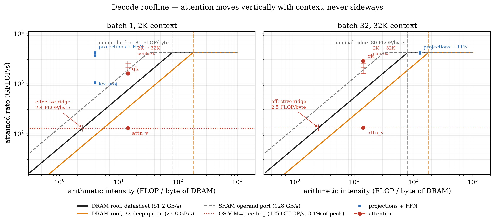

# Omni-LUT — The Memory Model, and What Bounds Decode

## 1. The memory model

### 1.1 The configuration

| | value | source |
|---|---|---|
| PE array | **32 × 4**, 32 RACs/PE, MU=4 | = **4,096 lanes** |
| clock | **500 MHz** | TSMC 7 nm |
| precision | W4 A16 **KV4** | Omni-LUT-KV4 |
| DRAM | **51.2 GB/s** peak, 64 B burst, ~90 ns | DDR5-6400 |
| request queue | swept 16 → 128 outstanding | *not stated in the paper* |
| operand port | **256 B/cycle = 128 GB/s** | `MU × array_n × NUM_RAC × kv_bits` |
| unified buffer | swept 256 KB → unlimited | *not stated in the paper* |
| model | LLaMA-3-8B, 32 layers, **GQA 32:8**, head_dim 128 | §1.6 scopes this |

### 1.2 The datapath, and how the KV cache reaches the array

```
DRAM ──► unified buffer ──► BQU ──► LGU ──► PE array ──► accumulator
(KV cache,   (on-chip     (quantise   (build     (32×4,
 weights)     staging)     to BCQ)     the LUT)   32 RAC/PE)
                                                       │
        weight buffer ─────────────────────────────────┘
```

The unified buffer is **staging, not a cache** — no tags, no replacement, no reuse tracking. In OS-V decode one LGU broadcasts to all 32 rows and the rest are gated off.

**The KV cache does not live on-chip.** It is re-read from DRAM on **every decode step**:

- one KV entry (one token, one head) = `128 × 4/8` = **64 B — exactly one DDR5 burst**
- per token, all 32 layers = `2 × 8 kv_heads × 128 × 0.5 B × 32` = **32 KB**

Per-step KV read is `32 KB × context × batch`, against a **constant** weight read:

| | 2K ctx | 32K ctx |
|---|---:|---:|
| batch 1 | 0.06 GB (2.4% of DRAM) | 1.00 GB (28.2%) |
| batch 32 | 2.00 GB (44.0%) | 32.00 GB (**92.6%**) |

**The buffer holds one instance's tile, not all of them.** Measured peak working set is **2.06 MB at batch 1, 8 and 32 alike** — *constant in batch*. That is the pipeline assumption stated out loud: instances stream one at a time, so the buffer needs one 2 MB tile, never the **512 MB** the full working set would occupy at batch 32.

### 1.3 The roofline



Three roofs, only one of which is on a datasheet.

The textbook reading says decode attention is memory-bound: intensity **14.2 FLOP/byte** against a ridge of `2 × 4096 × 500e6 / 51.2e9` = **80 FLOP/byte** — five and a half times inside the bandwidth-limited region.

**That reading is wrong.** The 80 FLOP/byte ridge assumes all 4,096 lanes work. `attn_v` is `(M=1, K=kv_len, N=head_dim)`: it lights **one of 32 PE rows** and attains **125 GFLOP/s — 3.1% of peak** — at every batch and every context. Against *that* ceiling the ridge is `125 / 51.2` = **2.4 FLOP/byte**, and 14.2 clears it comfortably.

| op | intensity | attained | of peak |
|---|---:|---:|---:|
| projections + FFN, batch 1 | 4.0 | 1,014–4,085 GFLOP/s | 25–99% |
| projections + FFN, batch 32 | **128.0** | ~3,940 GFLOP/s | 96% |
| `qk_matmul` | 14.2 | 2,774 GFLOP/s | 68% |
| **`attn_v_matmul`** | 14.2 | **128 GFLOP/s** | **3.1%** |

- **`attn_v` is compute-bound not because it does much arithmetic, but because the array is bad at this shape.**
- **Batching moves the projections across the ridge** — intensity 4.0 at batch 1 (weight-dominated) → **128.0** at batch 32. That one number is the whole batch story: weights are read once per step regardless of N, so batching multiplies compute by N and DRAM by less.
- **Attention cannot be moved that way**: its intensity is 14.2 at *every* batch, because both its FLOPs and its KV bytes scale with N.
- The identity `C/D = intensity ÷ effective ridge` reproduces the grid exactly: b1/2K `4.3 ÷ 28.7` = 0.15; b1/32K `7.3 ÷ 7.29` = 1.00.
- **The orange roof is the same machine with a 32-deep request queue** (§1.4). It drags the nominal ridge from 80 to **180 FLOP/byte**; `attn_v`'s effective ridge moves 2.4 → **5.5**, still under its 14.2, so the one compute-bound operation stays compute-bound and everything else gets worse.

### 1.4 The other two legs: SRAM, and DRAM latency

**SRAM never decides it.** Charged at the array's own 128 GB/s operand port, at datasheet DRAM bandwidth:

| batch | ctx | compute | DRAM | SRAM | SRAM/max |
|---:|---:|---:|---:|---:|---:|
| 1 | 2K | 7.7 ms | **51.3 ms** | 24.9 ms | 0.49 |
| 1 | 32K | 73.3 ms | **73.4 ms** | 61.3 ms | 0.83 |
| 8 | 2K | 57.5 ms | **61.6 ms** | 59.6 ms | **0.97** |
| 32 | 32K | **2331.5 ms** | 804.8 ms | 1342.5 ms | 0.58 |

- The 0.97 near-miss is **itself an artefact of ideal DRAM**: charge for a finite queue and the DRAM leg doubles while SRAM does not move, so the worst ratio falls to **0.78×**. Under realistic memory the port has margin everywhere.
- **A finite buffer barely touches decode** — DRAM is unchanged from unlimited down to **1 MB**, moving 2.7% only at 256 KB, and never from attention. Prefill DRAM rises **3.3× at 8 MB**: decode re-reads everything every step, so a small buffer destroys no reuse.

**DRAM latency decides it.** 51.2 GB/s is a peak; reaching it needs enough reads in flight to cover the round trip (Little's law):

```
reachable_bw = min(peak, outstanding × burst / latency)
```

At 90 ns and a 64 B burst, **72 reads must be in flight** — 4.5 KB in the air at all times. What a real queue reaches, and what it does to the grid:

| queue depth | reachable | memory-bound cells | C/D at b1/32K |
|---:|---:|---:|---:|
| no latency term | 51.2 GB/s | **11 of 30** | 1.00 |
| 128 | 51.2 GB/s | 11 of 30 | 1.00 |
| 64 | 45.5 GB/s | 13 of 30 | 0.89 |
| **32** | **22.8 GB/s** (44%) | **21 of 30** | **0.44** |
| **16** | **11.4 GB/s** (22%) | **30 of 30** | **0.22** |

> **Bandwidth is a property of the DRAM *and the requester*. The compute-bound triangle was an artefact of assuming an infinitely deep request queue.**

Weight DRAM stays constant at every cell either way — 49.81 ms per token at datasheet, **112.1 ms** at a 32-deep queue. Only the size of the floor moves.

### 1.5 The verdict

> **Ideal memory:** memory-bound in a low-batch, short-context triangle — **11 of 30 cells** — compute-bound elsewhere.
> **A 32-deep request queue:** memory-bound in **21 of 30**.
> **A 16-deep queue:** memory-bound **everywhere**.
> **SRAM decides none of it** — neither capacity above ~2 MB nor the operand port at its design rate. What decides it is DRAM, and how deep a queue you can keep full.

Compute ÷ DRAM at datasheet bandwidth; below 1.00 the array waits. Bold = first compute-bound cell in its column.

| batch | 2K | 4K | 8K | 16K | 32K |
|---:|---:|---:|---:|---:|---:|
| 1 | 0.15 | 0.23 | 0.38 | 0.62 | 1.00 |
| 2 | 0.28 | 0.43 | 0.67 | **1.04** | 1.51 |
| 4 | 0.52 | 0.76 | **1.12** | 1.56 | 2.02 |
| 8 | 0.93 | **1.28** | 1.69 | 2.10 | 2.44 |
| 16 | **1.57** | 1.93 | 2.27 | 2.54 | 2.73 |
| 32 | 2.37 | 2.60 | 2.74 | 2.84 | 2.90 |

At a 32-deep queue every cell divides by ~2.2 and the boundary retreats to batch 8–32.

**Inside the memory-bound region the binding resource is weights, not KV.** At 2K / batch 1 the byte split is weights **97.1%**, KV **2.9%** — a ratio latency cannot change, since it scales both legs alike. What latency changes is the waiting: the array idles **86%** of decode at datasheet bandwidth, **94%** at a 32-deep queue. **Latency does not shift the blame from weights to KV; it deepens the hole weights already dug.**

### 1.6 Scope, and what is still idealised

**This is a GQA result.** The Omni-LUT paper evaluates OPT-1.3B/2.7B/6.7B/13B/30B and LLaMA2-7B/13B — **all MHA**:

| configuration | max `C/D` over 30 cells | compute-bound cells |
|---|---:|---|
| LLaMA-3-8B GQA, KV4 | 2.90 | the triangle |
| OPT-6.7B **MHA**, KV4 | 1.07 | 1 of 30 |
| OPT-6.7B **MHA**, KV16 | **0.94** | **none** |

**So there were two independent reasons this model disagreed with the literature about bound-ness, and either alone is sufficient:** the paper measures MHA, and no roofline here charged for latency. Under either correction decode is memory-bound where the paper says it is.

Still idealised, in order of how much it matters:

1. **The latency term is a throughput clamp, not a latency model** — steady-state streaming reads, no dependent chains, no row misses, no refresh. **A scattered KV read does worse than modelled here.**
2. **KV buffer pressure is inexpressible.** The spill charge is `A_bytes × (n_tiles − 1)`, and `attn_v` has `n_tiles = 1` → **identically zero at any buffer size**, against a 2.06 MB working set. The operation that is 88% of decode cycles is the one that cannot be charged for buffering.
3. **The prefill spill charge prices an assumed loop order.** Read prefill capacity numbers as *the predicate fires here*, not as *prefill costs this much*.

---

## 2. Which pruning axis survives

**The claim**

> - Channel pruning, select-without-evict and KV residency each removed real DRAM traffic and each produced little or no speedup.
> - Eviction removed the same kind of traffic and **did** produce speedup.
> - One line of arithmetic predicts both, in advance.

- The three failures share nothing algorithmically — ThinK drops channels, Quest skips reads, residency moves bytes on-chip.
- They share only **which resource they attack**: KV DRAM bytes.
- Three unrelated methods failing identically ⇒ the failure is a property of the **resource**, not of any method.

### 2.1 The formula

```
cycles    = batch_size × per_round × rounds × qbit
per_round = LUT_GEN(3) + ceil(K / MU) + 1 + array_n + OUTPUT(2)
rounds    = ceil(n_tiles / array_m)
n_tiles   = ceil(N / (array_n × NUM_RAC))
```

For decode `attn_v` — `(M=1, K=kv_len, N=head_dim=128)`:

```
per_round = ceil(kv_len/4) + 10      ← the fixed 10 is the knee constant
n_tiles   = ceil(128/128) = 1
rounds    = ceil(1/32)   = 1
```

### 2.2 The axis table

| axis | technique | where it enters | cycles | DRAM | measured |
|---|---|---|---|---|---:|
| channel (`head_dim` = N) | ThinK | only `ceil(N/128)` | **null** | linear | **1.000×** |
| token (`kv_len` = K) | **eviction** (H2O, SnapKV) | `k_eff = ceil(K/4)` | **linear** | linear | **1.45× b1 · 15.96× b32** |
| token, read-only | Quest, TidalDecode | `k_eff`, storage unchanged | linear | linear | 12.85× b32 |
| **bit-width** (`qbit`) | KV3 / KV2 | outer multiplier | **linear** | **linear** | **~1.07–1.14× energy** * |

<sub>\* KV2 vs KV4, from the Omni-LUT paper's Fig. 10 energy bars — the one row measured elsewhere, and in a different unit. Every other figure is TPOT from our own model **at datasheet DRAM bandwidth**; §2.4 re-measures the ceilings under a finite request queue.</sub>

### 2.3 Row by row

**Channel — the null**

- `head_dim` is `attn_v`'s **output** dim `N`, reaching cycles through exactly one term: `ceil(N/128)`.
- For every `N ≤ 128` that term is **1**. Pruning 128 → 64, or → 8, does not change it.
- `N` is not weakly present. It is **absent** — which is why the result is *exactly* 1.000×.
- Channel pruning does shrink `qk` — but `qk` is **4.1% of decode**.
- **The axis that saves cycles is the stage that costs nothing.**

**Token — the survivor, and the proof the table is honest**

- `kv_len` is `attn_v`'s reduction dim `K`, entering via `k_eff = ceil(K/MU)` — linear and unbounded.
- So eviction **must** remove cycles, and therefore **must** work. Measured: **15.96× at batch 32.**
- A framework that only explains failures is unfalsifiable. This one commits in **both** directions from the same arithmetic.
- **Same bytes. Same hardware. Opposite outcome. One line of arithmetic apart.**

**Token, read-only — the control**

- Quest reads fewer blocks but stores the full cache → **byte-identical to eviction** on the read path.
- If bytes decided, the two would be indistinguishable. If `k_eff` decides, they should nearly coincide — and they do: **12.85× vs 15.96×**. The residual gap is **storage, not compute**.

**Bit-width — the axis with no null anywhere**

- `qbit` multiplies the *entire* expression; no `ceil` sits outside it to absorb it.
- KV4 → KV3 is 0.75× cycles **and** 0.75× bytes, unconditionally.
- **Channel pruning has a rounding boundary to die on. Bit-width does not.**

### 2.4 The ceilings, under a realistic memory profile

The bound that makes this quantitative: speedup if that resource became **entirely free**. Latency makes DRAM bind harder, so a KV technique should be worth *more* — the question is how much.

**Delete the entire KV cache:**

| profile | b1 / 2K | b1 / 32K | b32 / 2K | b32 / 32K |
|---|---:|---:|---:|---:|
| ideal memory | 1.01× | 1.07× | 1.05× | 1.12× |
| 90 ns, 64 deep | 1.01× | 1.08× | 1.07× | 1.14× |
| **90 ns, 32 deep** | **1.01×** | 1.13× | 1.16× | 1.32× |
| **90 ns, 16 deep** | **1.01×** | 1.17× | 1.26× | **1.65×** |

**Delete all weight traffic:**

| profile | b1 / 2K | b1 / 32K | b32 / 2K | b32 / 32K |
|---|---:|---:|---:|---:|
| ideal memory | 6.80× | 1.57× | 1.00× | 1.00× |
| 90 ns, 32 deep | **13.14×** | 2.13× | 1.11× | 1.01× |
| 90 ns, 16 deep | **21.78×** | 2.79× | 1.44× | 1.04× |

- **The realistic profile sharpens §2's conclusion rather than softening it.** Latency makes memory bind harder — but the memory that binds at low batch is *weights*. The weight ceiling triples, 6.80× → 21.78×; the KV ceiling at b1/2K does not move **at all**, staying **1.01× under every profile**.
- KV work does gain where KV already dominated: **1.12× → 1.65×** at batch 32 / 32K. Real, and still not the order of magnitude the byte counts suggest.
- **The one-line rule survives verbatim:** deleting the entire cache buys 1.01× at batch 1 / 2K whether DRAM runs at 51.2 GB/s or 11.4.

### 2.5 The discriminator

> The question is never *"how many bytes does this remove?"*
> It is *"does it reach `k_eff` or `qbit`?"*

- Touches only DRAM → lands inside the ceiling above.
- Lowers the compute roof → survives.
- Checkable on paper before a single simulation runs.

### 2.6 Bit-width: confirmed by the paper, bounded by it

- **The mechanism is confirmed by construction.** The paper builds KV3 and KV2 and states it in our terms: KV2 "eliminates 33% (vs. KV3) and 50% (vs. KV4) of the computational workload from these AA-GEMM bottlenecks" — that is `cycles ∝ qbit`.
- **The payoff is smaller than the halving implies.** Its Fig. 10 energy bars put KV2 within ≈ **1.07×** of KV4 on a decode-heavy workload and ≈ **1.14×** on a prefill-heavy one — for an axis that halves bytes *and* cycles.
- **It composes with eviction rather than competing.** `cycles ∝ k_eff × qbit` → orthogonal, so they **multiply**; evict-1024 at KV3 ≈ the *product*.
- **Still open on our side:** the paper measures *energy*. The **latency** effect of KV3/KV2, and how it stacks with eviction, is what our model can add.

### 2.7 All of it was measured in the wrong place


- **Weight traffic is constant in batch** — read once, however many sequences are in flight.
- **KV traffic scales with batch** — every sequence carries its own cache.
- So KV's *share* of DRAM, and the payoff for cutting it, **grows with batch**.
- `evict-1024`: **2.46× at batch 1 → 15.96× at batch 32** (datasheet bandwidth; §2.4 shows what a finite queue does to the ceiling these sit under).

### 2.8 Eviction is the exception that still obeys the rule

- Its batch-1 figure is **1.45×** under the pipelined model — inside the same ceiling as everything else.
- The **15.96× is a batch-32 result**, earned exactly where bytes finally bind.
- At batch 32 it wins twice: eviction also lowers the **compute** roof, since `kv_len` is `attn_v`'s reduction dim.
- **A technique that moves both roofs is robust. One that moves only the slack roof is not.**

### 2.9 What §2 does *not* establish

- **The channel null is `attn_v`-specific** — it depends on `head_dim ≤ 128` making `n_tiles = 1`.
- **Scoped to GQA + KV4** (§1.6). On MHA at KV16 the KV share is 25–84%, not 2.9%, and the ideal-memory ceiling is 1.11–1.46× before any latency correction.
- **The batch-1 numbers assume the serial roofline.** Under pipelining, eviction's 2.46× becomes 1.452×.
- **A scattered read is charged optimistically** (§1.6). Selective-KV methods that gather non-contiguous blocks cannot keep the request queue as full as a streaming read, so their true cost is above what any table here shows.
