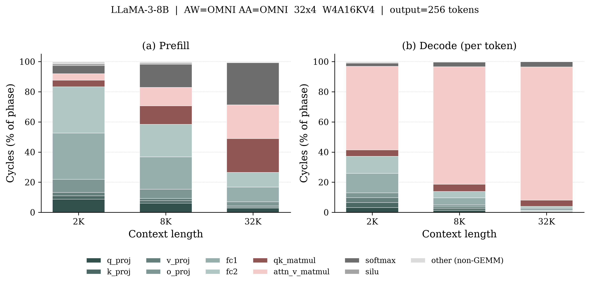
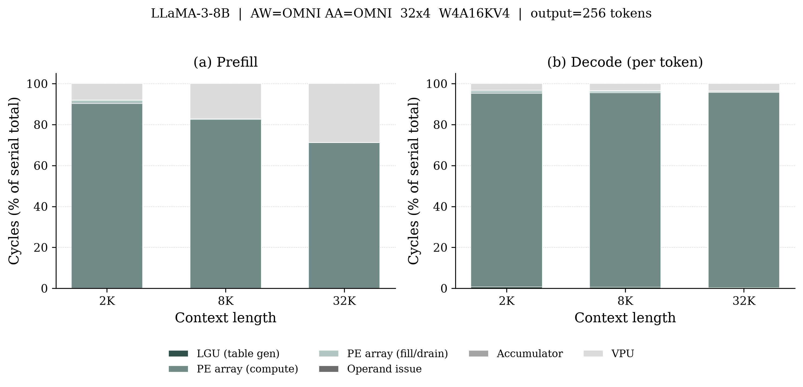

# Omni-LUT Cycle Breakdown Study

**Setup.** LLaMA-3-8B (32 layers, GQA 32/8, d_model 4096, d_ffn 14336),
Omni-LUT-KV4 (32x4 LUT array, W4A16KV4, `AW=AA=OMNI`), 500 MHz, 51.2 GB/s,
batch 1, 256 output tokens, standard attention.

```bash
cd analysis/cycle_breakdown
python run_cycle_breakdown.py
python plot_cycle_breakdown.py --normalize
python plot_cycle_breakdown.py --view unit --normalize
```

---

## 1. By pipeline stage



Share of phase cycles, top stages only:

| Stage | Prefill 2K | Prefill 32K | Decode/tok 2K | Decode/tok 32K |
|---|---:|---:|---:|---:|
| fc1 | 30.7% | 9.8% | 12.9% | 1.4% |
| fc2 | 30.7% | 9.8% | 11.2% | 1.2% |
| q_proj / o_proj | 8.8% each | 2.8% each | 3.2% each | 0.4% each |
| qk_matmul | 4.4% | 22.4% | 4.2% | 4.1% |
| attn_v_matmul | 4.4% | 22.4% | **55.5%** | **88.4%** |
| softmax (VPU) | 5.4% | **27.9%** | 2.1% | 3.4% |
| **Total cycles** | 3.12 G | 153.9 G | 4.09 M | 38.2 M |

**Prefill flips from FFN-bound to attention-bound.** At 2K, fc1+fc2 are 61% of
cycles. At 32K they fall to 20% while attention (qk + attn_v + softmax) takes
73% — attention grows quadratically, the FFN linearly.

**Decode is attention-dominated everywhere**, rising from 60% to 93% as context
grows. `attn_v_matmul` costs far more than `qk_matmul` because in `LUT_OS_V` its
N dimension is `head_dim`=128 while qk's is `kv_len`.

---

## 2. By hardware unit



Share of serial cycles:

| Unit | Prefill 2K | Prefill 8K | Prefill 32K | Decode/tok 2K | Decode/tok 32K |
|---|---:|---:|---:|---:|---:|
| PE array (compute) | 90.32% | 82.50% | 71.17% | 94.59% | 95.34% |
| PE array (fill/drain) | 1.59% | 0.36% | 0.08% | 1.14% | 0.55% |
| LGU | 0% | 0% | 0% | 0.69% | 0.33% |
| Accumulator | 0.09% | 0.02% | 0.00% | 0.46% | 0.22% |
| Operand issue | 0.04% | 0.01% | 0.00% | — | — |
| VPU | 7.96% | 17.11% | 28.75% | 3.12% | 3.56% |

**The array is efficient; the overheads are not the problem.** Systolic
fill/drain stays under 1.6% and the accumulator under 0.5%.

**The LGU is nearly free.** It costs *zero* in prefill: `LUT_WS` has no
table-generation term because generation is pipelined into the M-long activation
stream and fully amortized. It only appears in decode's `LUT_OS_V` (3 cycles per
round) and even there stays below 0.7%. The scale-aware LGU buys AA-GEMM support
at essentially no cycle cost.

**The VPU is the real long-context threat.** It grows 7.96% -> 28.75% of prefill
from 2K to 32K, almost entirely softmax. At 32K, softmax alone (85.9 s) is the
single largest prefill stage — larger than any LUT GEMM. Scaling the LUT array
would not help; the bottleneck has moved off it.

**BQU is not measured yet** (see TODO). The placeholder estimate puts online KV
quantization at 4.7 M cycles at 2K prefill and 75.5 M at 32K — ~0.05% of the
phase — and treats it as concurrent with the PE array, so it is excluded from
the serial totals above.

---

## 3. Cycles understate decode cost

Decode is DRAM-bound, so raw cycles are not latency:

| Context | Decode cycles/tok | Compute time | Roofline time | Gap |
|---|---:|---:|---:|---:|
| 2K | 4.09 M | 8.18 ms | 55.39 ms | 6.8x |
| 8K | 10.97 M | 21.94 ms | 70.67 ms | 3.2x |
| 32K | 38.15 M | 76.30 ms | 131.82 ms | 1.7x |

Every AW stage flags `bound="memory"` in decode (fc1: 1.06 ms compute vs 18.4 ms
DRAM). At short context the accelerator idles ~85% of decode waiting on weights;
KV4 quantization is what keeps attention's own DRAM traffic small enough that
attention stays compute-bound. The gap narrows at 32K only because attention
compute grows, not because memory improves.

---

## TODO

- **Measure the BQU.** BQU cycles are *not measured yet* — the original
  simulator does not model the BQU at all, so there was nothing to read.
  What the current code does instead: `bqu_metrics()` in `cycle_units.py` is a
  placeholder that charges the BEA one pass per bit-plane
  (`ceil(tokens x d_kv / bqu_width) x q`, from the greedy residual loop of
  Eq. 8-9) and the TSE one min/max reduction pass, Value path only. Throughput
  is *assumed* to be `bqu_width` elements/cycle (default 128) with the bit-plane
  loop serialized. Replace with real numbers from the BQU RTL; until then treat
  the BQU rows as an order-of-magnitude estimate. (`--bqu-width` to tune,
  `--no-bqu` to drop.)
- **Confirm the BQU really is overlapped.** Currently excluded from serial
  latency per Sec. IV-A ("on-the-fly"), but not verified against the RTL
  schedule. At ~0.05% of cycles the choice barely matters today; it would matter
  if the measured BQU turns out much slower.
- **Add BQU energy.** Not modeled — no characterization data in the energy
  models.
