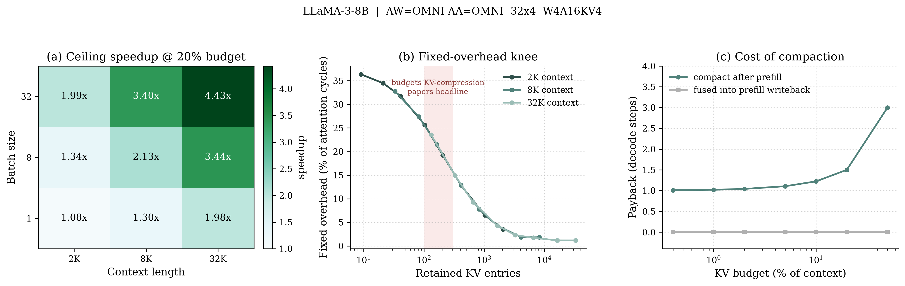
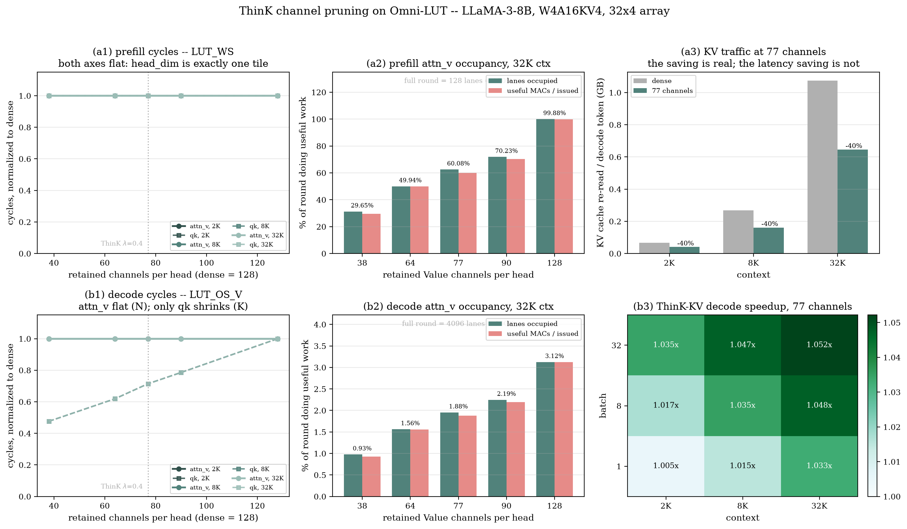

# Omni-LUT Simulator Study

Where the cycles go, where the bytes go, and which KV-reduction techniques
survive both.

**Setup.** Common to every section unless one says otherwise.

- Model: LLaMA-3-8B — 32 layers, GQA 32/8, d_model 4096, d_ffn 14336.
- Hardware: Omni-LUT-KV4 — 32x4 LUT array, W4A16KV4, `AW=AA=OMNI`,
  500 MHz, 51.2 GB/s (which is exactly `DDR5-6400` — see §16).
- Workload: batch 1, 256 output tokens, standard attention (no FlashAttention,
  so `qk_matmul` and `attn_v_matmul` stay separate stages), except where a
  section sweeps batch.

**How to read it.**

| | sections | question |
|---|---|---|
| **Cycles** | §1–§3 | where does the array actually spend time? |
| **KV reduction** | §4–§5 | what do eviction and channel pruning cost and buy? |
| **The memory model** | §6–§9 | what was the byte model missing, and what did fixing it change? |
| **Re-measured** | §10–§13 | the KV techniques against the corrected model, and why they fail alike |
| **What actually moves it** | §14–§16 | array packing, mask structure, and the memory part itself |
| **The framing itself** | §17 | what the no-overlap roofline costs every number above |

**Method for §6 onward.** Every model change is a `HardwareConfig` field whose
*disabled* default reproduces the previous numbers exactly, checked by
`analysis/regression/baseline.py` (36 configs x workloads, 22,488 values,
compared leaf by leaf). Nothing in §1–§5 moves unless asked. Every stage and its
revert point is in **Appendix A**; the checks run after each one are in
**Appendix B**.

**Where the full tables are.** Sections link to `*_report.md` files under
`analysis/memory/` and `analysis/array_packing/` — those hold every swept row,
while a section quotes only the numbers that carry the argument. **They are
generated, not tracked**: the `*_run.py` sweep is the source and the markdown is
its output, so a fresh checkout has the scripts but not the reports. Rebuild
them all with:

```
for f in analysis/memory/*_run.py analysis/array_packing/pack_run.py; do python "$f"; done
```

---

## 1. By pipeline stage


Share of phase cycles, top stages only:

| Stage | Prefill 2K | Prefill 32K | Decode/tok 2K | Decode/tok 32K |
|---|---:|---:|---:|---:|
| fc1 | 30.7% | 9.8% | 12.9% | 1.4% |
| fc2 | 30.7% | 9.8% | 11.2% | 1.2% |
| q_proj / o_proj | 8.8% each | 2.8% each | 3.2% each | 0.4% each |
| qk_matmul | 4.4% | 22.4% | 4.2% | 4.1% |
| attn_v_matmul | 4.4% | 22.4% | **55.5%** | **88.4%** |
| softmax (VPU) | 5.4% | **27.9%** | 2.1% | 3.4% |
| **Total cycles** | 3.12 G | 153.9 G | 4.09 M | 38.2 M |

- **Prefill flips from FFN-bound to attention-bound.** fc1+fc2 are 61% of cycles
  at 2K, falling to 20% at 32K while attention (qk + attn_v + softmax) rises to
  73% — attention grows quadratically, the FFN linearly.
- **Decode is attention-dominated everywhere**, rising 60% -> 93% with context.
- **`attn_v_matmul` costs far more than `qk_matmul`** — in `LUT_OS_V` its N
  dimension is `head_dim`=128 while qk's is `kv_len`, so attn_v serializes over
  the cache in `k_eff` while qk parallelizes across tiles.
- Consequence: any KV-reduction technique is aiming at 62% of decode cycles at
  2K and 96% at 32K.

---

## 2. By hardware unit


Share of serial cycles:

| Unit | Prefill 2K | Prefill 8K | Prefill 32K | Decode/tok 2K | Decode/tok 32K |
|---|---:|---:|---:|---:|---:|
| PE array (compute) | 90.32% | 82.50% | 71.17% | 94.59% | 95.34% |
| PE array (fill/drain) | 1.59% | 0.36% | 0.08% | 1.14% | 0.55% |
| LGU | 0% | 0% | 0% | 0.69% | 0.33% |
| Accumulator | 0.09% | 0.02% | 0.00% | 0.46% | 0.22% |
| Operand issue | 0.04% | 0.01% | 0.00% | — | — |
| VPU | 7.96% | 17.11% | 28.75% | 3.12% | 3.56% |

- **The array is efficient; the overheads are not the problem.** Systolic
  fill/drain stays under 1.6%, the accumulator under 0.5%.
- **The LGU is nearly free at full cache.** Zero in prefill — `LUT_WS` has no
  table-generation term, since generation is pipelined into the M-long
  activation stream and fully amortized. It appears only in decode's `LUT_OS_V`
  (3 cycles/round) and stays below 0.7%.
  - So the scale-aware LGU buys AA-GEMM support at essentially no cycle cost.
  - But see §4(b): this reverses at small KV budgets, where the same fixed
    3 cycles reach ~24% of attention cycles.
- **The VPU is the real long-context threat.** 7.96% -> 28.75% of prefill from
  2K to 32K, almost entirely softmax. At 32K, softmax alone (85.9 s) is the
  single largest prefill stage — larger than any LUT GEMM.
  - Scaling the LUT array would not help; the bottleneck has moved off it.
- **BQU is not measured yet** (see TODO). The placeholder estimate puts online KV
  quantization at 4.7 M cycles at 2K prefill and 75.5 M at 32K (~0.05% of the
  phase) and treats it as concurrent with the PE array, so it is excluded from
  the serial totals above.

---

## 3. Cycles understate decode cost

Decode is DRAM-bound, so raw cycles are not latency:

| Context | Decode cycles/tok | Compute time | Roofline time | Gap |
|---|---:|---:|---:|---:|
| 2K | 4.09 M | 8.18 ms | 55.39 ms | 6.8x |
| 8K | 10.97 M | 21.94 ms | 70.67 ms | 3.2x |
| 32K | 38.15 M | 76.30 ms | 131.82 ms | 1.7x |

- **Every AW stage flags `bound="memory"`** in decode — fc1 is 1.06 ms compute
  against 18.4 ms of DRAM.
- At 2K the accelerator **idles ~85% of decode** waiting on weights, not on KV.
- **KV4 quantization is what keeps attention compute-bound** — it shrinks
  attention's own DRAM traffic enough that the array, not memory, is the limit
  there.
- The gap narrows at 32K only because **attention compute grows**, not because
  memory improves.
- Consequence: any cycle-only speedup claim on decode is inflated by up to 6.8x.
  Report cycles and roofline time together, or not at all.

---

## 4. KV compaction



**Model.** Decode attends to a dense cache of `k` entries — `kv_len -> min(kv_len, k)`.
Covers uniform-budget compacted eviction (H2O, SnapKV, StreamingLLM, TOVA).
Not per-layer/per-head budgets (PyramidKV, Ada-KV), channel pruning (ThinK, §5), or
select-without-evict (Quest, TidalDecode, NSA — §10). Selection cost excluded for all.

### (a) Regime map — where eviction is worth deploying

Ceiling speedup at 20% budget, decode roofline time per token:

| batch \ context | 2K | 8K | 32K |
|---|---:|---:|---:|
| 1 | 1.08x | 1.30x | 1.98x |
| 8 | 1.34x | 2.13x | 3.44x |
| 32 | 1.99x | 3.40x | **4.43x** |

- Driver is KV's share of decode DRAM: **2.9% -> 93.8%** across that grid.
  Weight traffic amortizes over batch; KV traffic scales with it.
- **Batch 1 / 2K is the worst case and the technique is dead there** (1.08x) —
  decode reads 2.6 GB of weights per token vs 80 MB of KV. §1–3 all sit here.
- Bounds every KV-reduction technique, not just eviction.

### (b) Fixed-overhead knee — the one novel result

`attn_v` costs `per_round = 3 (LGU) + ceil(kv_len/4) + 5 (fill/drain) + 2 (accum)`.
The constant 10 does not shrink with the budget:

| Retained entries (32K ctx) | Fixed share of attention cycles |
|---:|---:|
| 32768 (full) | 1.2% |
| 6554 (20%) | 1.7% |
| 656 (2%) | 9.3% |
| 328 (1%) | 14.9% |
| 132 (0.4%) | **23.5%** |

- Fixed overhead goes **1.2% -> 23.5%** exactly across the budgets these papers
  headline (PyramidKV 0.7% cache, SnapKV 128 entries).
- 2K/8K/32K curves **collapse onto one line** against *absolute* retained
  entries — an architectural constant, not a workload artifact.
- Invisible on a GPU; applies to any method reducing attention to `k` operands.
- **So the published accuracy-vs-budget curves have a cost axis that does not
  transfer to LUT-based hardware.**

### (c) Compaction cost — settled, not a tradeoff

- Cost is one-time, benefit repeats every token: payback = `(1+b)/(1-b)` decode
  steps — **1.5** at 20% budget.
- Zero if eviction is decided during prefill: survivors are then the only KV ever
  written, so prefill writeback shrinks too (**-859 MB** at 32K/20%).
- **So the question is "evict before writeback or compact later?"** — the former
  strictly dominates. Not "can I afford to compact?"

---

## 5. KV channel pruning (ThinK)



**Model.** Decode reads a cache narrowed along `head_dim` — `head_dim -> d_ret`,
Key path, Value path or both. Assumes *materialized* pruning: survivors stored
packed, so the datapath sees a dense narrower tensor, never a sparse one.
Selection is static after prefill; its cost is excluded.

At 32K, batch 1, λ=0.4 (77 of 128 channels retained):

| | Prefill (LUT_WS) | Decode (LUT_OS_V) |
|---|---:|---:|
| `qk` cycles | 1.00x | **1.40x** |
| `attn_v` cycles | 1.00x | 1.00x |
| `attn_v` occupancy | 99.9% -> 60.1% | 3.12% -> 1.88% |

- **`attn_v` is exactly flat.** `head_dim` is its *output* dim N and
  `n_tiles = ceil(N/128) = 1` for all N ≤ 128, so pruning never crosses a tile
  boundary. Prefill is a null on both axes: `LUT_WS` tiles the reduction into
  `array_m x MU` = 128 elements, and `head_dim` is exactly one.
- **Only decode `qk` shrinks**, where `head_dim` is the reduction dim and enters
  `per_round` as `k_eff = ceil(K/4)`. It is 4.1% of decode, so 1.40x on it is 1.2%
  of the phase — the axis that saves cycles is the stage that costs nothing.
- **The cost is occupancy**, against a different denominator per phase: a 128-wide
  `LUT_WS` tile, versus OS-V's 4096 lanes of which `head_dim` was the most ever
  live. Head packing cannot fill the rest — §IV-D broadcasts one LGU's LUT to all
  rows, and two heads need two different LUTs.

**The only saving is DRAM.** ThinK-K decode roofline speedup at 77 channels:

| batch \ context | 2K | 8K | 32K |
|---|---:|---:|---:|
| 1 | 1.005x | 1.015x | 1.033x |
| 8 | 1.018x | 1.035x | 1.048x |
| 32 | 1.035x | 1.047x | **1.052x** |

- **How.** Roofline time is `sum of max(cycles/freq, dram_bytes/BW)`; pruning moves
  only `qk`'s memory term, and `qk` stays memory-bound throughout. So the saving is
  exactly `delta K bytes / 51.2 GB/s` — 133.75 ms measured against 133.69 ms
  predicted at batch 32 / 32K. A bytes effect, nothing LUT-specific.
- **Not derivable from the KV-DRAM share.** K is 41.5% of decode DRAM there, which
  predicts 1.199x; `attn_v` compute is 79.8% of the phase and untouchable. §3's
  warning running the other way.
- **ThinK-V is inert on every axis modelled** — `attn_v` is compute-bound under KV4,
  so its Value bytes were already hidden under compute. The byte saving is a
  *capacity* result this simulator cannot cash (see TODO).
- **This was flagged unverified, and §9/§15 verified it — against ThinK.** At the
  time DRAM was one flat bandwidth number, so a packed 77-channel cache and a
  strided read of 77 of 128 looked identical, and the model assumed the former.
  Once granularity is charged, **the assumption turns out to be load-bearing**:
  the table above holds only if the retained channels are contiguous *and*
  compacted. Under an unstructured mask the DRAM saving — the only saving ThinK
  has — is **exactly zero** (§15). Compaction itself pays back in 4 decode tokens
  of 256, or 0 if fused into the prefill writeback.

---

## 6. The gate, and what it caught

- §1–§5's TODO asked for DRAM and SRAM models. Those edit
  `_calculate_memory_access` and `_simulate_matmul` — which every published
  number depends on — so the first step was making accidental change impossible.
- `baseline.py` captures `to_dict()` plus both roofline helpers, drops
  per-execution duplicates (an op runs once per layer per decode step with
  identical metrics — 129 MB of exact copies) and stores a SHA-256 of the
  unslimmed tree so nothing is lost by the slimming.
- **It caught a defect in itself before it could hide a real one.** 816 reported
  "regressions" against an unchanged tree were type artifacts: `interp1d`
  returns `np.float64`, which reprs as `np.float64(0.035…)` fresh and `0.035…`
  after a JSON round-trip. Fixed at the source (`float(energy)`) *and* in the
  comparison. Had this landed mid-change, a genuine regression would have been
  invisible in the noise.

---

## 7. SRAM capacity — what actually fits

`peak_sram_bytes` was computed and printed but never checked against anything.
`sram_capacity_kb` makes it a constraint; on overflow, spill policy v1 re-reads
the resident operand once per column tile (no re-tiling).

| context | dense | any KV budget <= 4096 |
|---|---:|---:|
| 2K / 8K | 1024 KB | 1024 KB |
| 32K | **2176 KB** | **1024 KB** |

- **Decode's working set is floored at 924.5 KB** by the FFN/projection tiles.
  The KV tile only becomes the binding term past ~16K context — below that,
  capacity is not the constraint at all.
- **At 32K a KV budget buys a smaller chip**: 2.1x less SRAM. That is the one
  place the budget pays in capacity rather than latency.
- **Policy v1 is non-monotonic and the flag is the trustworthy output.** Past
  1024 KB at 32K the binding term is the KV tile itself, which needs re-tiling,
  so v1 flags the overflow and charges nothing — the *larger* overflow prices
  lower. Use `sram_overflow`; treat `sram_refetch_bytes` as first-order only.
- **Prefill is excluded, and this is a model gap not a result.**
  `_calculate_peak_sram` holds the entire prefill activation matrix —
  O(seq x d_model), 59 MB at 2K context and 2.1 GB at 32K — so it overflows at
  every plausible capacity and its spill charge is a meaningless ~770 GB
  constant. A real accelerator tiles prefill over the sequence; the model does
  not. **Open.**

---

## 8. Batch as a capacity axis

Enforcing capacity exposed that batch was a *loop* in one half of the model and
a *dimension* in the other: projections issue as one GEMM with
`proj_m = batch x seq_len`, so their footprint scaled with batch, while
attention issues per `(batch, head)` and its footprint did not move at all.
`sram_batch_model="concurrent"` makes attention agree with projections.

Largest batch whose decode working set fits, 32K context (32 = sweep ceiling):

| SRAM | dense | budget 4096 | budget 1024 |
|---|---:|---:|---:|
| 4 MB | 1 | 8 | 32 |
| 8 MB | 2 | 16 | 32 |
| 16 MB | 4 | 32 | 32 |

- **Capacity and batch trade one-for-one**, and at fixed capacity a KV budget
  buys batch directly — 8x at 4 MB for a 4096-entry budget.
- **`"concurrent"` is a scheduling assumption, not a measurement.** It is the
  assumption the projection side already made, which is why adopting it makes
  the model self-consistent — but hardware that serialises batch shows none of
  this. `"sequential"` remains the default.

---

## 9. DRAM burst granularity

DRAM was one flat bandwidth number, so a packed cache and a scattered gather
cost the same. `dram_burst_bytes` rounds each access up to a burst;
`dram_read_eff` / `dram_write_eff` carry bytes actually moved while
`dram_read` / `dram_write` stay logical.

| access | burst | charged | waste |
|---|---:|---:|---:|
| dense 4-bit KV entry, 64 B | 32 B | 64 B | 1.00x |
| ThinK entry (`d_ret=77`), 38 B | 32 B | 64 B | **1.68x** |
| dense entry, 64 B | 128 B | 128 B | **2.00x** |

- **Alignment matters, not run length.** A dense 4-bit KV entry is
  `128 x 4/8` = 64 B — exactly two 32 B bursts — so the term is inert for
  everything else this study models.
- **The one misaligned shape is ThinK's pruned entry.** §5
  computed ThinK's speedup as K-cache bytes / 51.2 GB/s, which assumes every
  saved byte is a saved transfer. At 38 B per entry that is not true, so a
  compacted ThinK cache plausibly returns part of its saving to burst rounding.
  Quantifying it needs the pruned-entry layout pinned down. **Open.**
- `dram_power_model.dram_energy` already models 1024 B rows and 8 B bursts
  internally. That is a different question — what fetching costs, versus which
  bytes get fetched — so the effective count feeds it rather than competing.

---

## 10. Select-without-evict (Quest / TidalDecode / NSA)

`kv_budget.py` deferred selective reading because on a flat model it is
indistinguishable from compacted eviction. With burst granularity it can finally
be told apart — and the answer is that it still isn't.

| pages read | entries | evict (eff) | select (eff) | ratio |
|---|---:|---:|---:|---:|
| 16 | 256 | 17,913,118,720 | 17,913,118,720 | 1.000x |
| 1024 | 16384 | 21,843,705,856 | 21,843,705,856 | 1.000x |

- **Byte-identical at every `k` tested**, because a 4-bit KV entry is exactly one
  DDR-class burst — so a page-gathering reader is burst-aligned at *every* page
  size, down to `page = 1` (token-granular).
- **Granularity is a bit-width property here, not a selection property.** At
  3-bit KV an entry is 48 B and a single-entry gather does pay 1.33x.
- **`kv_budget.py`'s deferral was correct for this hardware**, not an oversight.
- **What selection actually costs is its metadata.** Quest-style per-page min/max
  scales with the *context*, not with what was selected, so its share grows as
  selection gets more aggressive: 2.2–2.6% of decode DRAM at page 16, 0.5–0.6% at
  page 64. Decode speedup at 3% read goes 2.464x -> 2.404x once it is charged.

---

## 11. KV residency across decode steps

The cache is append-only — entries 1..n-1 are bit-identical between step *t* and
*t+1* — yet the model re-read the whole cache from DRAM every token, with no
reference to on-chip capacity. `kv_sram_kb` removes whatever fits.

At 32K, batch 8, dense:

| buffer | DRAM saved | energy saved | TPOT gain |
|---|---:|---:|---:|
| 8 MB | 2.3% | 1.5% | 0.4% |
| 32 MB | 9.2% | 6.1% | 1.5% |
| 128 MB | **36.8%** | **24.6%** | 6.2% |

- **Residency is an energy and capacity lever, never a throughput one.** The
  bytes go away; the latency does not, because `attn_v` is compute-bound under a
  4-bit KV cache and the traffic removed was not on the critical path.
- **Eviction's advantage is real, not an artifact of the baseline's re-reads.**
  This fix was built to test that and came back negative: `evict-1024` at batch
  32 holds ~16x from a 0 KB buffer to a 128 MB one. The dense K+V working set is
  32 MB per layer at batch 1 and **1,024 MB at batch 32**, so no plausible buffer
  holds a meaningful fraction.
- **The two compose, and the order matters:** eviction shrinks the working set to
  a size a buffer can hold (§8), and residency then removes what is left.
- Steady-state model: the one-time buffer fill after prefill is not charged,
  which slightly favours residency — under 0.4% of KV traffic over 256 output
  tokens.

---

## 12. Where KV reduction actually pays


Decode weight traffic is **constant** in batch (7.65 GB — read once, reused
across the batch); KV traffic scales linearly. So the KV share of decode DRAM,
which is the ceiling on what *any* KV technique can win, moves enormously:

| context | batch | KV share | ceiling |
|---|---:|---:|---:|
| 8K | 1 | **10.1%** | 1.11x |
| 32K | 1 | 30.9% | 1.45x |
| 32K | 8 | 78.2% | 4.58x |
| 32K | 32 | **93.5%** | 15.32x |

Decode TPOT speedup vs dense at 32K:

| technique | batch 1 | batch 8 | batch 32 |
|---|---:|---:|---:|
| evict 1024 | 2.460x | 6.971x | **15.957x** |
| select 3% | 2.404x | 6.358x | **12.854x** |
| evict 4096 | 2.156x | 4.418x | 6.520x |
| ThinK-K `d=77` | 1.034x | 1.049x | 1.054x |

- **Entry-count techniques were measured in the wrong place.** At batch 1 they
  compete for a tenth of decode traffic; their batch-1 numbers understate them
  several-fold.
- **Channel pruning does not recover, and that is a different ceiling.** ThinK
  cuts bytes — decode DRAM falls to 0.825x at batch 32 — but latency barely
  moves, so the bytes were never on the critical path. `attn_v` is compute-bound
  and the `LUT_OS_V` round cost has no N term, so pruning `head_dim` idles array
  columns instead of saving cycles. **§5's conclusion stands, for the
  reason it gave.** More batch cannot fix it.

---

## 13. The recurring pattern

Three independent techniques — ThinK channel pruning, select-without-evict, and
KV residency — each removed real DRAM traffic and each produced little or no
speedup, for the same reason: **`attn_v` is compute-bound under a 4-bit KV
cache, so KV bytes are usually not the critical path.**

- The axes differ in whether they touch cycles at all:

  | axis | cycles | DRAM |
  |---|---|---|
  | channel (`head_dim` = N) | **null** — no N term | linear |
  | token (`kv_len` = K) | linear via `k_eff` | linear |
  | **bit-width (`qbit`)** | **linear** | **linear** |

- `cycles = batch_size x per_round x rounds x qbit`, so **bit-width is the only
  axis that is a direct multiplier on cycles as well as bytes**, with no null
  anywhere, and it composes with eviction rather than competing.
- Separately, decode `attn_v` occupancy is 3.12% of 4096 lanes because `M=1`.
  Cycles scale *exactly* linearly with `batch x heads`, so at batch 32 there are
  1,024 instances each lighting 128 of 4,096 lanes, run back-to-back.

---

## 14. OS-V array packing — the one axis that is not memory


`attn_v` decode is issued as `(M=1, K=kv_len, N=head_dim=128)`, so
`n_tiles = ceil(128/128) = 1` and `rounds = ceil(1/32) = 1`: **one of 32 PE rows
does work, at any context length**, and cycles scale exactly linearly with
`batch x heads`. `PackedOSVSimulator` (`analysis/array_packing/`) packs `P`
instances into one pass, each with its own LGU driving `array_m/P` rows.

Verified against `OMNI_LUT.pdf` §IV-C/§IV-D: the LUT is generated from the
**activation** (query / attention scores), not the KV cache, so packed instances
need `P` distinct LUTs and `P` ungated LGUs. What they share is the K/V
bit-plane stream — the "weight" operand — which is what output-stationary
already shares across rows. OS-V gates 31 of 32 LGUs *precisely because* `M=1`;
packing generalises that broadcast.

- **`attn_v` recovers exactly 32×** at every context, occupancy 3.12% → 99.9%.
- **`qk` has two different mechanisms, and only one is what you'd guess.** Below
  `kv_len = array_m x array_n x NUM_RAC = 4096` rows genuinely sit idle. At or
  above it the body is full and the only waste is the **tail**:
  `rounds = ceil(n_tiles/32)` rounds up to whole 32-row passes, leaving up to 31
  rows idle in the last one. Packing subdivides the array into a finer quantum
  and recovers exactly `32·ceil(n_tiles/32)/n_tiles` — 1.94× just past a tile
  boundary, 1.12× at 32K, decaying as `1/n_tiles`. It is neutral **only** when
  `n_tiles` is an exact multiple of 32, and decode `kv_len = context + token_idx`
  almost never is.

**32× on the stage is not 32× on the token.** `attn_v` was compute-bound, so
packing drives its compute time under its memory time and the stage flips to
memory-bound. Decode TPOT at 32K context:

| P | batch 1 | batch 8 | batch 32 |
|---|---:|---:|---:|
| 2 | 1.353x | 1.604x | 1.701x |
| 4 | 1.643x | 2.297x | 2.617x |
| **8** | **1.755x** | **2.637x** | **3.118x** |
| 16 / 32 | 1.755x | 2.637x | 3.118x |

**The ceiling arrives at P=8, and P beyond that buys literally nothing** — the
remaining cost is DRAM.

**Which is what makes it affordable.** Packing `P` instances means `P` working
sets resident. A GQA group shares its K/V tile; past the group size (4 here) the
tiles are distinct. Decode peak SRAM at 32K, batch 1:

| P | independent | GQA-shared | fits 16 MB? |
|---|---:|---:|:---:|
| 4 | 8.3 MB | 2.3 MB | yes |
| **8** | 16.5 MB | **4.5 MB** | **yes** |
| 32 | 66.0 MB | 18.0 MB | no |

The two tables meet at **P=8, GQA-aware: the full achievable speedup for
4.5 MB.** The 32× cycle figure is both unreachable in latency and unaffordable
in SRAM, and neither fact matters, because nothing above P=8 is worth having.

**What this does not charge for**, computed rather than waved at:

- **Weight-FIFO / KV-SRAM read bandwidth.** One live row consumes
  `MU x array_n x NUM_RAC x kv_bits` = 256 B/cycle ≈ 128 GB/s at 500 MHz. P=8 is
  ~1.0 TB/s; P=32 is 8,192 B/cycle ≈ **4.1 TB/s**. The simulator enforces SRAM
  *capacity* and has no bandwidth term at all, so packing converts an idle-array
  problem into an SRAM-bandwidth problem it cannot bill. This is the first thing
  to check before believing the result.
- **LGU ungating power.** §IV-D gates 31 of 32 LGUs specifically to save power;
  P=32 ungates all of them. Cycles fall 32×, LGU dynamic energy rises up to 32×,
  and the energy model sees neither.
- **Energy neutrality here is an artefact, not a finding.**
  `os_v_energy_model.py:23` charges `n_tiles/array_m` and `omni_energy_model.py`
  divides M==1 OS energy by `array_m` — energy is *already* amortised over all
  32 rows while cycles charge a full round for one. **The two halves of the
  model disagree today, and packing is what would make them agree.**
- P live LUTs plus a P-way broadcast tree; per-instance output routing
  (`OUTPUT_CYCLES` unchanged); and the scheduling tail when `batch x heads < P`.

---

## 15. Unstructured pruning — the layout decides which axis is allowed to work


Every KV result above was measured on a **compacted** retained set: eviction
compacts, ThinK narrows the entry to a solid `d_ret` block, page selection
gathers whole pages. Real masks are irregular. `analysis/memory/unstructured_kv.py`
prices that, and the answer turns on one coincidence: **a 4-bit KV entry is
`128 × 4/8` = 64 B, exactly one DRAM burst.**

An axis is free if and only if its mask cuts on a boundary already burst-aligned
in the chosen layout — and the two axes disagree about which layout that is:

| layout | token-wise mask | channel-wise mask |
|---|---|---|
| **token-major** (today's model) | cuts *between* entries → **100% of the saving kept** | cuts *inside* one → **0.0% kept** |
| **channel-major** (transposed) | **0.0% kept** | **99.9% kept** |

- **Perfectly antisymmetric, and there is no third option.** A KV element has
  two indices; one is the minor axis and the other is strided. **Choosing a KV
  layout is choosing which pruning axis is permitted to work at all** — a
  decision taken in the memory subsystem that silently determines which pruning
  papers are deployable.
- **It is a cliff, not a slope.** In token-major, channel groups of 1, 2, 4, 8,
  16, 32 and 64 all keep **exactly 0%** of the saving. 64 contiguous channels of
  128 is worth precisely as much as one: nothing. Only the full 128-channel
  entry pays. There is no partial credit for a partly-structured mask.
- **The saving goes to zero, not negative.** A gathering reader never pays more
  than streaming the whole covering region, so the model clamps there
  (`_dram_effective_bytes(cap_bytes=...)`). Unstructured channel pruning
  degrades to *precisely* dense: 50% of channels removed, 1.000× the traffic.
- **This makes channel pruning null on both axes at once.** §5
  showed it does not move `attn_v` cycles (no N term in the `LUT_OS_V` round);
  this shows an unstructured mask does not move bytes either. Measured decode
  TPOT speedup is **1.000× at batch 1 and at batch 32**.
- **Head-wise is the only axis free in both layouts** — a head is its own
  address region — and it is exactly linear (2.00× at half the KV heads). It is
  also the axis the pruning literature uses least.
- **Composition breaks at the third axis.** head+token at 50% each reaches
  0.250× traffic and 1.504× TPOT; adding an unstructured channel mask removes a
  further 50% *logically* and moves effective traffic **not at all**. The same
  mask with contiguous 128-channel groups reaches 0.125× and 1.528×.
- **The mask itself is not free.** A per-(token, channel) bitmap is 1 bit
  against a 4-bit datum — **25% of the dense cache**, charged over the full
  context whether or not the element survived (0.250× → 0.375×). A per-head
  static mask is negligible and is what a deployable design would use.

Two costs are modelled optimistically — gather scheduling is free (no
request-queue or MSHR pressure, though a scattered gather has far more
outstanding requests than a stream), and the mask is assumed resident when the
gather issues. **Both push the same way: unstructured masks are worse than this
says, not better.** Accuracy is out of scope throughout; this prices the choice,
it does not dispute it.

Full tables: `analysis/memory/unstructured_report.md`.

---

## 16. Memory technology, and the throughput terms that were never billed


`dram_bandwidth_gbps` and `dram_burst_bytes` were independent knobs, so a sweep
could describe a part that does not exist. A technology fixes both.
`simulator/memory_tech.py` holds presets with their derivations — and the first
thing it settles is that **`DDR5-6400` *is* the simulator's default** (51.2 GB/s,
64 B), asserted rather than assumed. **Every number in §1–§15 is a DDR5-6400
result**, whether or not it said so.

### (a) The burst matters more than the bandwidth

| technology | bandwidth | burst | channel group needed to collect any saving |
|---|---:|---:|---:|
| DDR5-6400 | 51.2 GB/s | 64 B | **128** (the whole entry) |
| HBM3 | 819.2 GB/s | 32 B | **64** |

- **The cliff sits at one burst, so halving the burst halves the required
  group.** A channel mask must assemble one whole burst of contiguous retained
  data before it collects anything. On HBM that is 64 channels; on DDR5 it is
  all 128. §15's "channel pruning is worthless unstructured" is therefore a
  DDR5 statement — **HBM makes half-entry channel groups viable.**
- This is bought in the memory subsystem, not in the pruning algorithm.

### (b) 16× the bandwidth buys 1.10× of decode

| technology | dense TPOT | vs DDR5 | prune 50% tokens | prune 90% tokens |
|---|---:|---:|---:|---:|
| DDR5-6400 | 2,568 ms | 1.000× | 1.936× | 7.708× |
| HBM2E | 2,332 ms | 1.101× | 1.921× | 7.506× |
| HBM3 | 2,332 ms | 1.101× | 1.921× | 7.506× |

- **No memory technology rescues decode**, which is §13's compute-bound result
  arriving from a new direction. HBM2E and HBM3 are indistinguishable: once the
  DRAM roof clears the compute roof, more bandwidth is inert.
- **The corollary inverts the usual expectation.** A KV technique is supposed to
  be worth most where bandwidth is scarcest, so HBM should devalue it. It does
  not — 1.936× on DDR5, 1.921× on HBM3. Token pruning cuts `kv_len`, the `K` of
  both attention GEMMs, so it removes **cycles** as well as bytes. **Its value is
  portable across memory technologies precisely because it was never really a
  bandwidth optimisation.**

### (c) SRAM bandwidth — built, wired everywhere, and shipped inert

`hw.sram_bandwidth_gbps` (0 = unlimited, the default) adds the third roofline
term `max(compute, DRAM, SRAM)` at all six sites through one shared
`_op_roofline_time`, so no site can silently miss it.

| SRAM bandwidth | TTFT | vs unlimited | TPOT | vs unlimited |
|---|---:|---:|---:|---:|
| unlimited | 219.3 s | 1.00× | 127.49 ms | 1.000× |
| 128 GB/s | 953.5 s | **4.35×** | 136.94 ms | **1.074×** |
| 512 GB/s | 255.6 s | 1.17× | 127.49 ms | 1.000× |

- **Decode is not SRAM-throughput-limited** — TPOT moves 1.074× even at the
  geometry-implied 128 GB/s. This is trustworthy: `M=1` makes decode
  tiling-inert. **It settles the open question §14 left hanging.**
- **Prefill's 4.35× is not a hardware result and must not be quoted as one.**
  Prefill charges 113,670 GB of SRAM traffic against 3 GB of DRAM. That ratio is
  the untiled-activation defect — the same one that makes `_calculate_peak_sram`
  claim a 2.1 GB prefill working set (§7) — surfacing through a new term.
  **Prefill stays parked until prefill tiling lands.**
- **128 GB/s is itself an over-charge**: it is one *operand port*, while
  `sram_read` lumps A-reads, B-reads and C accumulator traffic together.

### (d) Can P=8 packing actually be fed?

Computed from array geometry rather than from the lumped `sram_read`, which (c)
just showed cannot be trusted:

| packing | KV bytes/cycle | required KV-port bandwidth | verdict |
|---|---:|---:|---|
| P=8 | 2,048 B/cycle | **1.02 TB/s** | plausible (banked SRAM) |
| P=32 | 8,192 B/cycle | 4.10 TB/s | needs a redesign |

- **§14's P=8 survives its own bandwidth check.** P=32 does not — which costs
  nothing, since §14 already showed P=32 buys no TPOT over P=8. **Two independent
  arguments now agree on the same operating point.**

Full tables: `analysis/memory/bandwidth_report.md`.

---

## 17. Compute/memory overlap — the assumption under every latency number


The roofline sums `max(compute, memory)` **per operation** and never lets one
operation's memory hide behind another's compute. Real hardware double-buffers.
`hw.overlap_model` supplies both extremes — `"serial"` (today's default, and
every number above) and `"pipelined"` = `max(sum compute, sum memory)`. **They
bracket the truth; neither is it.**

Decode time per token, and how much `"serial"` overstates it:

| context | batch | compute | DRAM | serial | pipelined | overstated |
|---|---:|---:|---:|---:|---:|---:|
| 8K | 1 | 20.9 ms | 55.7 ms | 69.62 ms | 55.71 ms | 1.25× |
| **32K** | **1** | **73.3 ms** | **73.4 ms** | **128.80 ms** | **73.40 ms** | **1.75×** |
| 32K | 8 | 644.4 ms | 238.6 ms | 714.01 ms | 644.41 ms | 1.11× |
| 32K | 32 | 2331.5 ms | 804.8 ms | 2609.91 ms | 2331.50 ms | 1.12× |

- **1.75× is larger than most techniques in this document were measured to
  save.** The modelling assumption outweighs the things being modelled.
- **2× is the hard ceiling and 32K/batch 1 nearly reaches it.** `sum(max)` can
  exceed `max(sum)` by at most 2×, attained exactly when the two resources are
  equal — and there they are **73.3 ms against 73.4 ms**. §3 described decode's
  gap narrowing from 6.8× to 1.7× as attention compute growing to meet the
  memory wall; it lands almost exactly on it. **That is the single worst
  operating point for a no-overlap model, and the one this document quotes
  most.**
- **Prefill barely moves** (1.00–1.07×): compute-bound almost everywhere, so
  there is little memory time to hide.

### It corrects §4 and §12 at batch 1

Decode TPOT speedup over dense at 32K, under each model:

| technique | batch 1 serial | batch 1 pipelined | batch 32 serial | batch 32 pipelined |
|---|---:|---:|---:|---:|
| evict 4096 | 2.156× | 1.391× | 6.520× | 6.403× |
| evict 1024 | 2.460× | **1.452×** | 15.957× | 14.323× |
| evict 256 | 2.538× | 1.468× | 23.209× | 20.733× |

- **About 40% of eviction's batch-1 speedup was the assumption.** Once DRAM
  hides under compute, cutting DRAM further buys nothing — the compute roof
  (73 ms) does not move, and eviction at batch 1 is a pure traffic technique.
- **The three budgets converge** — 1.391× / 1.452× / 1.468× — because all are
  pressed against that same roof. Under `"serial"` they still look separable
  (2.156× / 2.460× / 2.538×), **a distinction the assumption manufactures.**
- **At batch 32 they survive** (15.957× → 14.323×) because there eviction is not
  only a traffic technique: `kv_len` is `attn_v`'s reduction dimension, so it
  lowers the compute roof too. **A technique that moves both roofs is robust to
  how they are combined; one that moves only the slack roof is not.**
- **This sharpens §12 rather than contradicting it.** §12 said entry-count
  techniques were measured in the wrong place because batch 1 gives them a tenth
  of decode traffic to attack. This adds a second, independent reason:
  even the traffic they *do* remove was charged as if none could overlap.
  **Rankings by batch are unchanged; batch-1 magnitudes are upper bounds twice
  over.**

**What neither model captures.** `"pipelined"` assumes buffering it never checks
for — two operand sets resident, which `sram_capacity_kb` would have to allow.
Dependencies are ignored, so the reachable overlap is across *layers* and decode
steps, not within one layer's `qk → softmax → attn_v` chain, and pipeline fill
and drain are uncharged. Non-GEMM work is outside both models entirely, so the
VPU softmax — 27.9% of prefill cycles at 32K (§2) — is absent from both columns.

Full tables: `analysis/memory/overlap_report.md`.

---

## TODO

### Model gaps

- **Tile prefill in `_calculate_peak_sram` — the top item.** It holds the whole
  activation matrix, so prefill capacity claims and its spill charge are both
  unusable (§7). The only outright *bug* this work found, and §16(c) showed it is
  **worse than a capacity problem**: the SRAM *traffic* terms are written against
  the same untiled A, so prefill charges 113,670 GB and a 4.35x TTFT the moment a
  bandwidth term exists. It now blocks a second study, not just its own.
- **Per-port SRAM accounting.** §16(c) bills a lumped `sram_read` — A-reads,
  B-reads and C accumulator traffic together — against one operand port's
  bandwidth, which over-charges even where the traffic is right.
- **Measure the BQU.** Not measured yet — the original simulator does not model
  it at all. `bqu_metrics()` in `cycle_units.py` is a placeholder: BEA one pass
  per bit-plane, TSE one min/max pass (Value path only), assumed `bqu_width`
  elements/cycle. Replace with RTL numbers; treat current rows as
  order-of-magnitude. (`--bqu-width` to tune, `--no-bqu` to drop.)
- **Confirm the BQU is really overlapped.** Excluded from serial latency per
  Sec. IV-A ("on-the-fly"), unverified against the RTL schedule. Only matters if
  the measured BQU is much slower.

### Open questions

- **Mixed-precision KV.** `qbit` is modelled as static and
  `analysis/bit_width/` sweeps only fixed widths, so per-token / per-channel
  allocation (KIVI / ZipCache / KVQuant), giving a weighted-average effective
  `qbit`, is unexplored — and `qbit` is the one axis that multiplies cycles as
  well as bytes (§13).
  **Bit-plane *skipping* is dead, and should not be attempted.** BCQ bit-planes
  are ±1-valued (§VI-B), so an all-zero plane is not representable and skipping
  is structurally meaningless on this encoding. Reducing `qbit` itself is real;
  eliding planes within a fixed `qbit` is not.
- **Measure the energy side of channel pruning.** Compute energy is charged per
  *tile* (`omni_energy_model.py`), so ThinK-V saves exactly 0 J as modelled while
  ThinK-K saves via `k_eff` — the same K/V asymmetry as cycles. Whether the idle
  RAC columns can actually be power-gated is unmodelled and needs per-column
  characterization; the ceiling is small, since `attn_v` compute is only 2.0% of
  decode energy at batch 1 and 5.0% at batch 32.
- **LGU ungating power under packing.** §14 recovers cycles by ungating all 32
  LGUs; the energy model sees neither that nor the cycle saving, and its two
  halves already disagree (§14's last bullet).

### Closed

- ~~**No compute/memory overlap.**~~ Both bounds now exist (§17). `"serial"`
  remains the default because `"pipelined"` assumes buffering the model cannot
  verify — but every latency figure in §1–§16 is a `"serial"` figure and is an
  upper bound by 1.00–1.75×, and eviction's **batch-1** speedups specifically
  are inflated ~40%.

- ~~**Build DRAM and SRAM latency models.**~~ Done — §6–§9 and §16.
- ~~**Pin down ThinK's pruned-entry layout.**~~ Answered by §15, and worse than
  the item feared: the risk is not that a 38 B entry is misaligned, it is that
  *any* channel mask below the full 128 is sub-burst in token-major. ThinK's DRAM
  saving requires the retained channels to be **contiguous and compacted**, a
  layout obligation §5 never stated. Unstructured, the saving is exactly zero.
- ~~**Bill the SRAM read bandwidth.**~~ Done in §16(c–d). Decode is not
  SRAM-limited (TPOT 1.074x at 128 GB/s) and P=8's ~1.02 TB/s KV port is
  buildable, so §14 is a design rather than a ceiling.

---

## Appendix A — staged record and revert points

Each memory-model change landed as **one commit** whose *disabled* default
reproduced the previous numbers exactly. A checkpoint line cannot name its own
commit, so each SHA was recorded by the next commit; `git log --oneline` is the
tiebreaker if they ever disagree.

| stage | `HardwareConfig` field | disabled default | § | revert point |
|---|---|---|---|---|
| 0 — regression gate | — | — | §6 | `2342e90` |
| 1 — SRAM capacity | `sram_capacity_kb` | `0` = unlimited | §7 | `9eaa1db` |
| 1b — batch as a capacity axis | `sram_batch_model` | `"sequential"` | §8 | `301f9d5` |
| 2 — DRAM access granularity | `dram_burst_bytes` | `0` = exact bytes | §9 | `569b8ce` |
| 3 — selective attention | *(analysis only)* | — | §10 | `d63e355` |
| 4 — KV residency | `kv_sram_kb` | `0` = no buffer | §11 | `5e3771f` |
| 5 — attention score staging | `score_sram_kb`, `prefill_kv_dram_read` | `0`, `False` | §16 | `00a79b7` |
| 5b — unstructured KV masks | *(three default-identical hooks)* | — | §15 | `40f9071` |
| 7 — memory tech + SRAM bandwidth | `sram_bandwidth_gbps` | `0.0` = unlimited | §16 | `9b0b15c` |
| 10 — compute/memory overlap | `overlap_model` | `"serial"` = no overlap | §17 | `4d593bc` |

```
git revert <sha>            # undo one stage, keep the later ones
git reset --hard <sha>      # rewind to the end of that stage
```

**Stage 6 (prefill tiling) is not done** — it is the top TODO item, and §16(c)
is blocked on it.

**Two premises died in the building**, recorded here rather than quietly dropped:

- **Stage 2's motivating example was wrong, and Stage 3 disproved it.** The
  premise was that a flat bandwidth model makes 1% selection look ~100x cheaper
  than it is. A 4-bit KV entry is 64 B — exactly one burst — so a page-gathering
  reader is burst-aligned at *every* page size. Building Stage 2 is still what
  made the question answerable, and it did find a genuinely misaligned shape
  (§15), but the example that motivated it was not real.
- **Stage 7 shipped inert against its own plan.** The plan chose
  `sram_bandwidth_gbps = 128.0`; measuring it first is what changed the call, and
  §16(c) states exactly what turning it on costs.

---

## Appendix B — standing checks

Run after *every* model change, not just the one being worked on.

1. `python analysis/regression/baseline.py check` → *Identical to the baseline ✓*
   with all features at their disabled defaults. Re-capture only when a field is
   added, and only after confirming the diff contains nothing but the new `hw.*`
   keys and the per-entry `full_sha256`.
2. `sum(cycle_units(...)) == _calculate_cycles(...)` across the 50-combination
   check — the cycle model is untouched by the memory work, so any movement
   means the wiring leaked.
3. `python analysis/channel_prune_breakdown/think_run.py` — its pre-flight
   assertions pass and the dense baseline still reproduces §3's roofline column
   (55.39 / 70.67 / 131.82 ms).
4. Every sweep's own pre-flight suite still passes: `prefill_run.py` (7),
   `pack_run.py` (9), `unstructured_run.py` (9), `selective_run.py` (5),
   `bandwidth_run.py` (5).
